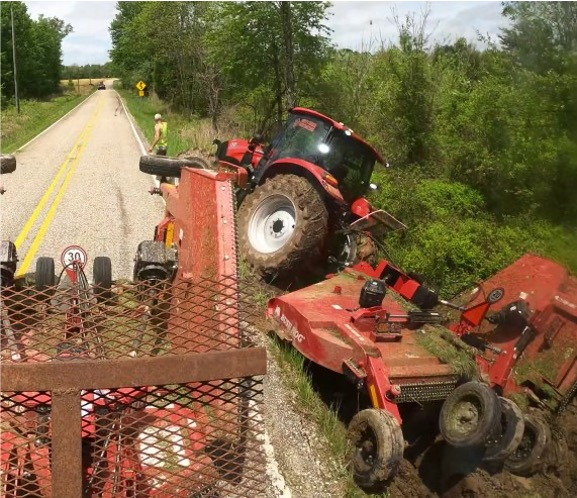
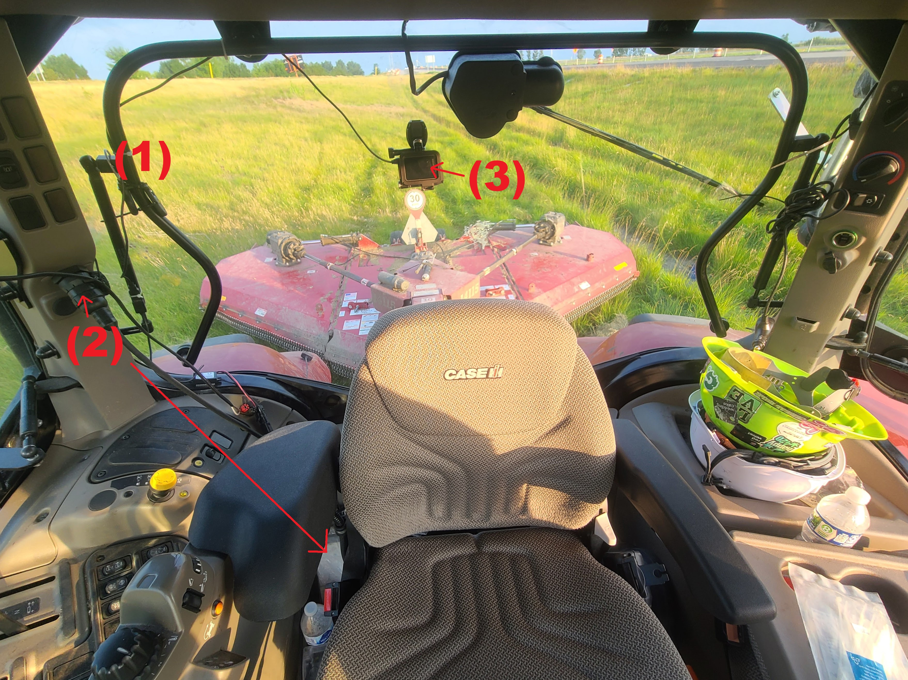

\clearpage
# Introduction
[This chapter will clearly define the research problem and the motivation for research.]

## Thesis & Goals
[This section will clearly explain the central thesis and goals of the paper. It will draw a direct line from the initial problem to the final answer proved in this document.]

**Programmable action-sports cameras and standard agricultural telematics loggers can be used to record useful data about roadside mowing operations for understanding current operations and informing future developments.** This study describes a project in which a data collection process was developed to meet the following goals:

 1. Characterize real-world mowing environments on Indiana roadways.
 2. Identify challenges encountered by mowers on Indiana roadways.
 3. Quantify mower behaviors and responses to encountered conditions.

# Background
[This chapter will demonstrate understanding of the subject and all associated literature.]

## Roadside Mowing
[This section will provide a deep literature review of roadside mowing, identifying typical methods, its purpose, importance, and the unique challenges inherent to the work.]

### Right-of-Way Vegetation
[This section will explain the reasons vegetation is tolerated in right-of-way spaces. It will also provide a review of the types of vegetation found in these environments in Indiana.]

### Conventional Vegetation Management
[This section will explain the current vegetation management strategies used in Indiana. It will also review the strengths and weaknesses of these policies.]

### Other Vegetation Management Technologies
[This section will describe alternative technologies for vegetation management. It will review the strengths and weaknesses of these options, and explain why they are not used in Indiana.]

### Autonomous Mowers
[This section will provide a deep literature review of autonomous mowing, explaining why it would be a useful extension to conventional vegetation management and what technologies would be necessary to develop before it could be viable.]

## Agricultural Telematics Logging
[This section will provide a deep literature review of telematics logging in agricultural, industrial, and related contexts. It will discuss the rugged environment in which these activities take place, and explain how common equipment for these fields is designed to handle the conditions.]

### Geospatial Data
[This section will describe the types of geospatial data recorded by modern telematics systems. It will explain the capabilities of different kinds of GPS technologies and review the strengths and weaknesses of typical systems.]

### Embedded Computer Systems
[This section will describe the types of controller networks typical to modern tractors (i.e. ISOBUS) and the machine data that can be recorded from them. It will explain the way that CAN messages are encoded and decoded, and probably a small passive-aggressive rant about the lack of standards compliance among major manufacturers.]

## Video Activity Recording
[This section will provide a deep literature review of video activity recording in agricultural, industrial, and related contexts.]

### Operator-Facing Video Capture
[This section will describe the typical uses of cameras pointed into the tractor cabin. It will outline the kinds of information that can be gleaned from these recordings and explain why they are not as useful for the thesis put forth above.]

### Implement-Facing Video Capture
[This section will describe the typical uses of cameras pointed out of the tractor cabin. It will outline the kinds of information that can be gleaned from these recordings and explain why they would be useful for the thesis put forth above.]

### Long-Term Reliability in Rugged Environments
[This section will explain the environmental and operational constraints that inform camera selection. It will describe why research-grade equipment is not rugged enough to be reliable in the field over long periods. It will also contrast the typical use-case of dash-cameras with those used in a long-term study such as this one.]

\clearpage
# Methods
[This chapter will clearly describe the appropriate research methods and tools developed and used for this study.]

## Year 1 
The first studied mowing season lasted from May 2023 through October 2023. Initial prototypes of data collection systems were tested in the months leading up to the start of the season, and collection procedures were further developed in multiple iterations throughout the year. Mowing operations were performed by INDOT contractors with privately owned equipment, as shown in @Fig:mower. Operations were performed on roadways across many parts of the state of Indiana, including a range of different terrain conditions, some of which was quite rugged, as shown in @Fig:stuck.

{#fig:mower width=5in}

{#fig:stuck width=4in}

### Telematics Logging
[This section should explain the ISOBlue and the data recorded with it. It should also explain the details used in processing those recordings.]

Telematics were logged using a Purdue ISOBlue system [@Balmos_IsoblueAvenaFramework_2022]. These systems record all messages on the attached CAN bus, time and location as received from GPS, and have the capability to be remotely accessed over a cellular data connection (though cellular features were not used in this study). These devices were chosen because they are open-source [@OatsCenter_IsoblueHardwareAvena_2023] and technical support was readily available from local colleagues. Logged data was stored in three SQL tables; one for GPS data, one for CAN data, and one for cellular data. The GPS table contains columns for timestamps, latitude, and longitude. The CAN table contains columns for timestamps, network interface, message ID, and message data. The cellular table was not used in this study.

GPS data was recorded at a sample rate of 1 Hz. To calculate the ground speed of the monitored tractor, the haversine method [@Deniau_CalculateDistance2_2024] was used to find the distance between each consecutive coordinate pair, and this was divided by the difference between associated timestamps.

All CAN data transmitted on the monitored tractors' ISOBUS were recorded to logs. The only messages used for this study were those with a message ID of 18FE4307, which contained data about the power take-off (PTO) used by the towed mower.

### Video Recording
[This section will explain the GoPro and configuration settings used in 2023. It will also describe the process used to develop the configurations found.]

Timelapses were recorded using a GoPro Hero 8 Black action-sports camera (San Mateo, CA). These systems were flashed with an experimental firmware [@Newman_GoproLabs_2024] that allows recordings to be triggered programmatically in response to different conditions. Cameras were triggered to record by "keyed" power (power only enabled when the tractor is switched on), with an additional delay provided to encourage recording only mowing operations, not any initial preparations. Recording stopped automatically after keyed power was switched off. 

In the configuration used first, the program took wide-angle high-resolution photographs at a sample rate of 1 Hz, each saved as a separate file so that any possible corruption would affect only a single frame. This configuration used a delay of 30 minutes after keyed power was switched on, putting the camera to sleep for that duration.

The second configuration used during the 2023 season recorded wide-angle videos at a sample rate of 1 Hz, each instance of keyed recorded in one large file to allow video compression to reduce file storage requirements. This configuration also used a delay of 30 minutes, but it was split between 25 minutes of sleep and 5 minutes of idling in order to allow the camera time to fix on a GPS signal.

GPS metadata was extracted from video timelapses using an open-source python program [@Casillas_Gopro2gpx_2023].

Cameras were deployed at the start of the mowing season and memory cards were rotated every two weeks during operational periods. Remote tracking was not available, so monitored tractors were located each time by word-of-mouth from the mowing foreman.

### Video Processing
[This section will explain the video annotation methods used in 2023. It will provide detailed explanations of the AI and manual review process.]

Visual recordings were analyzed by both manual review and computer vision programs. Manual reviewers watched all footage and noted how many obstacles were encountered, what kinds of obstacles were encountered, the nature of each encounter (successful avoidance, non-destructive touch, or destructive collision), as well as any unusual circumstances encountered. Computer vision programs [@Sprague_AnalyzingVideoIsobus_2024] were used to quantify how much time the mower spent on road shoulders and lane surfaces, what kind of road was being mowed (rural or highway), and when the towed mower received engine power.

## Validation Process
[This section will discuss the test rig, testing protocols, and other methods used to characterize the improved data collection systems.]

### Manual GPS Testing
[This section will explain how the cameras were taken on several test drives in order to test the GPS fix and time synchronization requirements.]

Cameras were manually tested in several conditions in order to verify the reliability of GPS positioning. Each new camera configuration was tested in both low-speed and high-speed travel. Low-speed travel was tested by carrying the camera on foot, to simulate the slow movement of a tractor actively mowing. High-speed travel was tested by carrying the camera on a bicycle or automobile, to simulate the faster movement of a tractor in transit between mowing sites.

### Automated Reliability Testing
[This section will show the final electromechanical design and programmed behavior of the test rig and its various subsystems. It will also describe the verification process used to gather quantitative data about camera reliability.]

## Year 2
[This section will explain the materials and processes used in 2024 in detail.]

{#fig:int24 width=5in}

### Telematics Logging
[This section will explain the ISOBlue and the data recorded with it. It will explain the details used in processing the recordings.]

### Video Recording
[This section will explain the GoPro and configuration settings used in 2024. It will also describe the process used to develop the configurations found.]

### Video Processing
[This section will explain the video annotation methods used in 2024. It will provide detailed explanations of the AI and manual review process.]

\clearpage
# Results
## Year 1
[This section will present the data gathered in 2023 and identify basic trends.]

### Data Collection System Uptime
[This section will show the percentage uptime for each component of the original data collection system, as well as the uptime of the system as a whole, during the 2023 season.]

### Obstacle Collisions
[This section will identify the obstacles encountered in 2023 and note which were most common, which were most often damaged, and so forth.]

### On-Road Operations
[This section will note how long the mowers spent on-shoulder and on-road during operation. It will also mention how long was spent in transit (on-road and not operating).]

## Validation Process
[This section will present the data gathered by the test rig and other validation protocols.]

### Manual GPS Testing
[This section will note which configurations were able to most reliably record with GPS metadata. It will also identify which configuration options were necessary to correct flaws.]

### Automated Reliability Testing
[This section will give the system uptime of the test-rig runs for each tested configuration.]

## Year 2
[This section will present the data gathered in 2024 and identify basic trends.]

### Data Collection System Uptime
[This section will show the percentage uptime for each component of the original data collection system, as well as the uptime of the system as a whole, during the 2024 season.]

{#fig:shatter width=5in}

### Obstacle Collisions
[This section will identify the obstacles encountered in 2024 and note which were most common, which were most often damaged, and so forth.]

### On-Road Operations
[This section will note how long the mowers spent on-shoulder and on-road during operation. It will also mention how long was spent in transit (on-road and not operating).]

\clearpage
# Conclusion
[This chapter will provide effective analysis of the results presented above, and demonstrate the theoretical and applied significance of the findings published here.]

## Year-to-Year Trends
[This section will compare the 2023 and 2024 data sets, comparing and contrasting the results.]

## Evidence-Based Mowing Standards
[This section will present quantitative standards that autonomous mowers must meet in order to match the performance of human-operated equipment.]

## In-Field Data Collection Processes
[This section will summarize the challenges presented by the unique conditions found in professional roadside mowing. It will then recommend the types of technologies best suited for studying activities in these conditions and explain how those technologies meet the associated environmental and administrative requirements.]

\clearpage
# References
