\doublespacing \linenumbers
\clearpage
# Introduction {#sec:intro}
## Project Context
Roadside mowing is a critical part of infrastructure maintenance in the modern transportation network. Indiana has thousands of miles of public roads and highways, and these are crucial for facilitating safe and efficient travel throughout the region, enabling the free-flowing movement of people and goods and supporting the state's economic vitality. To ensure those roads remain effective and reliable, regular maintenance and upkeep is mandatory. Most of these state-maintained roads are flanked by vegetation of some kind, and---as is explored in @Sec:veg of this document---mowing is the most practical method for keeping that vegetation from growing beyond the level that is desired.

Improvements to the roadside mowing process could provide many benefits to the state, including reduced labor costs, enhanced worker safety, and better environmental impacts. Current vegetation control strategies involve multiple different pieces of equipment and levels of worker involvement through the various steps in the process. Increasing the efficiency of that process, reducing the required time and costs, would allow the state to allocate its resources more effectively and include more priorities in its decisionmaking process with any newfound excess. Additionally, there are safety risks for both workers and the public inherent in working along the side of public roads. More efficient vegetation control technologies could reduce worker and equipment exposure to that environment, naturally reducing risks and enhancing the overall safety of the process. Finally, improvements to the system may improve environmental impacts, whether through greater energy efficiency reducing the carbon footprint of the process or more sustainable practices leading to healthier roadside habitats and nearby ecosystems. Improvements to roadside vegetation control may take multiple forms, and innovations in technology could lead to unexpected new solutions to this complex problem.

Currently, this maintenance is performed with large mowers towed by tractors and teams of pedestrian workers with handheld trimmers. Instead of focusing on more exotic solutions to the problem, this study was conceived as part of an effort to characterize the requirements for and feasibility of a more simple extension to existing strategies: automating the current process. Autonomous vehicles are already an area of very active research for both on-road automotive systems and off-road agricultural machines, so it is reasonable to extrapolate that autonomous mowers could be developed for roadside applications in the future.

However, several challenges present themselves when attempting to qualify such incremental improvements to existing vegetation control systems. There exists very little *quantitative* research on the current state of performance and associated risk factors of Indiana's mowing process, so objective measures of the outcomes to any changes in the system are difficult to design and prove.

## Research Gap
Most existing research on roadside vegetation management has focused on the efficacy, cost-efficiency, and environmental impact of presently available vegetation control technologies. These studies consider the impact at a much broader scale than is relevant for this project: comparing fundamentally different control technologies involves primarily reporting results at the *outcomes* of such treatments to roadside environments. This project instead seeks to understand the mowing *environment itself* in order to enable quantitative predictions on the performance of future vegetation control technologies. As existing research does not focus on inputs to the mowing process, there are no known rigorously defined methods and procedures for studying the process of mowing in rugged roadside environments. This project, therefore, aims to prepare a process for data collection and analysis that allows collecting quantitative results on current roadside mowing operations.

## Thesis & Goals
**Programmable action-sports cameras and standard agricultural telematics loggers can be used to record useful data about roadside mowing operations for understanding current operations and informing future developments.** This study describes a project in which a data collection process was developed to meet the following goals:

 1. Characterize real-world mowing environments on Indiana roadways.
 2. Identify challenges encountered by mowers on Indiana roadways.
 3. Quantify mower behaviors and responses to encountered conditions.

Additional research is also indicated for developing appropriate computer vision systems to support the project goals, as large volumes of visual data must be collected to effectively study this topic.

\clearpage
# Background
This chapter provides the reader with background knowledge necessary to understand the broader project introduced above. @Sec:veg gives an overview of roadside vegetation and the various technologies and protocols used to manage its growth. @Sec:telematics covers telematics logging in relevant industries and explains several of the challenges inherent to such data collection in the context of roadside mowing. Penultimately, @Sec:var discusses the use of cameras to record visual data about machine activity and the environment and decisions faced by equipment operators during roadside mowing operations. The final @Sec:visual_odo gives a brief introduction to visual odometry, a computer vision task focused on estimating the speed of and distance traveled by a photographed moving object.

## Roadside Mowing {#sec:veg}
The importance and multifaceted functions of the vegetation itself is given in @Sec:row_veg. A discussion on available management methods, both conventional and alternative options, is given in @Sec:veg_management. The unique challenges of the work and an explanation of why novel technologies are necessary are given in @Sec:new_tech.

### Right-of-Way Vegetation {#sec:row_veg}
Vegetation is a common fixture along roads all throughout Indiana and much of the United States. Roadside vegetation can serve many functions, and different configurations can offer different trade-offs for their effects on the environment, road traffic, and safety. A major function of vegetation in right-of-way spaces is erosion control [@Milton_HandbookRoadEcology_2015], as bare soil will often wash out during precipitation and deposit large quantities of sediment downstream [@Richardson_PracticesErosionControl_1970; @Bochet_FactorsControllingVegetation_2004; @Baets_ImpactRootArchitecture_2007; @Wang_OptimizingRoadsideSlope_2024]. Roadside vegetation can also help control multiple types of pollution. It can reduce the total amount of water runoff, preventing contaminants from directly washing deeper into the watershed [@Wang_OptimizingRoadsideSlope_2024], and automotive dust particles containing heavy metals like cadmium, lead, nickel, and zinc can be captured by roadside trees and other leafy plants [@SzyszlakBarglowicz_FunctionRoadsideVegetation_2013], preventing the fine particulate matter [@Ozdemir_MitigationImpactRoadside_2019] and other types of air pollution [@Tong_RoadsideVegetationBarrier_2016] from drifting far from the roadway. Noise pollution, too, is reduced by roadside vegetation [@Reethof_EffectPlantingsRadiation_1973], even relatively small barriers [@Kalansuriya_EffectRoadsideVegetation_2009]. In addition, planting natural scenery along roadsides can have psychological effects on passing drivers, potentially reducing stress and crash rates [@Fitzpatrick_InfluenceClearZone_2014] and affecting drivers' speed and lane-centering behavior [@Calvi_DoesRoadsideVegetation_2015]. Beyond that, species chosen for these roles need not be the purely utilitarian options that are often chosen, such as non-native grasses and trees. Using beautiful plants for the task, such as native wildflowers, can improve the aesthetic appeal of the roadside environment without compromising on their functions [@Dana_WildflowersIndianaHighways_1996; @Isaacs_MaximizingArthropodMediated_2009; @Ebbers_EstablishmentWildflowerIslands_2024], though sometimes native plants may require multiple seasons to become fully established [@Herold_IntegratedVegetationManagement_2014; @Barnes_NativeWarmSeason_2000]. Additionally, roadside vegetation can provide habitats for many organisms in the local ecosystem, and changes to the vegetation can have significant ecological impacts [@Forman_RoadEcology_2002; @Valko_RoadsideGrasslandRestoration_2023], so the choice of plant species and how they are maintained should be chosen with careful regard to their effects on local wildlife [@Ryu_QuantifyingBenefitsRoadside_2025].

However, controlling that roadside vegetation is an important part of infrastructure maintenance. While the plants perform many important functions, as explained in detail above, poorly controlled vegetation can reduce visibility, affect snow accumulation, cause sudden changes in wind pressure [@KocurBera_RoadsideVegetationSafety_2015], obscure signage, and damage road surfaces [@Johnson_BestPracticesHandbook_2008; @Milton_HandbookRoadEcology_2015]. For these reasons, keeping roadside vegetation present but trimmed to a reasonable level throughout the right-of-way is critical to ensuring the safety and longevity of a road system.

### Vegetation Management {#sec:veg_management}
The most commonly used methods today are a combination of mowing and chemical herbicides [@Herold_IntegratedVegetationManagement_2014; @Nemec_HowEngineersRoadside_2022]. The Indiana Department of Transportation (INDOT) divides road right-of-way into four zones for vegetation management purposes: Zone 1 is the paved road surface, Zone 2 is the clear zone (for safety purposes), Zone 3 is the selective zone (where only invasive weeds and woody vegetation are removed), and Zone 4 is the outer zone (where only invasive weeds and hazardous tree species are removed) [@FHAOPDER_VegetationManagementToolbox_2015]. The current practice, as recommended by @Herold_IntegratedVegetationManagement_2014, is to mow the clear zone, typically with large flex-wing mowers, and apply selective herbicides to the entire clear zone on a carefully prescribed schedule to minimize its effects on desired grasses while maximizing its effects on unwanted vegetation. The selective zone and outer zone receive herbicide only in spot treatments directly at unwanted plants, not wide-area sprays. Near the edges of obstacles and along steep slopes, mechanical mowing is manually performed with string trimmers, as the heavy equipment used elsewhere cannot access such areas [@Nemec_HowEngineersRoadside_2022].

One vegetation management strategy that has been adopted somewhat more recently in INDOT policy is the use of native prairie grasses in place of non-native roadside vegetation. These have been shown to resist droughts and require less maintenance once established [@Herold_IntegratedVegetationManagement_2014], though some studies have found that other nearby species may share genes or otherwise compete with the planted species in later seasons [@Li_SuccessionalEstablishmentMowing_2008]. As native species are supremely well-adapted to the local climate and soil conditions, they effectively defend against weeds, protect sensitive areas, and reduce ecosystem impacts [@Steinfeld_RoadsideRevegetationIntegrated_2007]. A mixture of native species that occupy different ecological niches are recommended, in order to outcompete weeds in all respects. When established in such a manner, native plants tend to require little to no herbicidal treatments, and often require less frequent mowing than artificially introduced species, leading to significantly lower management time and cost requirements in the long run [@Barnes_NativeWarmSeason_2000; @ODell_NativeRoadsidePerennial_2007].

Mowing and chemical herbicides are effective and commonly used throughout the United States for roadside vegetation control, as they can be performed effectively at a reasonable cost. However, there are some concerns with the practice; frequent mowing tends to favor the growth of short, sod-forming grasses [@Li_SuccessionalEstablishmentMowing_2008]. It also upsets the natural succession of roadside species, as it unnaturally disrupts the distribution of light and nutrients, in addition to culling a larger proportion of taller plants than shorter ones [@Ryu_QuantifyingBenefitsRoadside_2025]. Likewise, there are ecological concerns with the use of herbicides, especially when sprayed indiscriminately in wide areas, as is often the most cost-effective method. Overuse can even contribute to agrochemical runoff, a common water pollution concern, and some kinds of herbicides are more broadly toxic than others. As a result, the use of more efficient and environmentally friendly herbicides is recommended over broad-spectrum options [@Li_SuccessionalEstablishmentMowing_2008]. Investing in more native re-vegetation projects, which have a higher upfront cost but require less mowing and less herbicide in later seasons, as discussed in more detail above, is one of the most effective solutions to the environmental concerns expressed here. It continues to be pursued as a long-term priority, but deploying the strategy takes time and not every roadside is perfectly suited for it, so it is not yet omnipresent on Indiana roadways.

Beyond conventional mowing and herbicides, there exist several other technologies for vegetation management. Research has been done on the possibility of using mulching or applying alternative organic herbicides [@Barker_AlternativeManagementRoadside_2009], and even exotic technologies like infrared radiation [@Burnham_NonChemicalMethods_2003], but these are not commonly used in Indiana due to their inferior performance and higher cost compared to the standard mowing and chemical treatments discussed previously. One unusual management strategy that could be used in the state is controlled burning. This is most effective in areas that have been replanted with native tall-grass prairie species, as these plants are naturally adapted to surviving periodic brush fires. Such fires can help clear detritus and allow more light to reach slower-growing tall-grasses climbing up from the prairie floor, while most undesired plants have difficulty surviving the brief but intense flames. Prescribed burns can therefore be used to preferentially support the native prairie plants while simultaneously removing invasive weeds and woody brush species [@Brandt_IntegratedRoadsideVegetation_2015].

### Safety Requirements and Autonomous Mowers {#sec:new_tech}
A key risk in roadside maintenance of any kind is the exposure of workers to traffic. This can prove to be dangerous for both the maintenance workers and road travelers in the event of a collision or other accident, potentially resulting in expensive property damage and injuries or even fatalities [@Mardikes_ConstructingDigitalTwin_2025]. As a result, mechanical mowing has been called "the most hazardous" vegetation control method, and it is associated with high costs due to insurance requirements and property damage outlays [@Hyman_BestManagementPractices_1999]. However, large, slow-moving mowers continue to be used because all known alternatives require too much manual labor, environmental impact, or are otherwise logistically infeasible. Given the currently available alternatives, the current strategy generally scores quite well on balancing six key factors: worker safety, public safety, environmental impact, herbicide use, cost and efficiency, and public perception [@TeeterBalin_FeasibilityAlternativeVegetation_2006]. Novel technologies and solutions must be developed in order to improve beyond this status quo.

One technology under development that might address the concerns above is autonomous mowing robots. Adopting robotic mowers would remove the equipment operators from direct exposure to the roadside, protecting them from proximity to traffic and potentially limiting the total number of maintenance workers required to be onsite in the first place [@Arsenault_AutonomousMowingImproving_2010]. Additionally, autonomous mowers could be deployed as a fleet of smaller robots working in concert, rather than as a one large machine. This would present less of a distraction than larger equipment might [@Creed_ImplementationValidationObstacle_2011] and reduce the severity of any collisions, as an accident involving any one small robot would be far less destructive than a collision with the monolithic heavy equipment that is currently used instead [@Mardikes_AutonomousRoadsideMowing_2023].

Autonomous mowers exist on the market today, but they are not suitable for roadside operations. These devices can trace their history to advances built upon remote-controlled mowers in the early 2000s [@Chavez_StudyObjectDetection_2009], such as the Danish research robot CASMOBOT, which explored the basics of driver-assist technology in the leadup to its completion in 2009. CASMOBOT, and similar machines that followed, performs "semi-automatic" mowing, in which a human operator manually drives the machine to set a perimeter around the target area, and then the machine automatically covers all area inside that perimeter. Initial devices in this vein required full-time human supervision, as they did not have any capability for real-time obstacle avoidance [@Jensen_ComputerAssistedSlope_2009]; modern commercial machines are capable of automatically avoiding detected hazards. However, these devices are not yet trustworthy enough for fully autonomous operation, as they can only achieve an acceptable safety rating by maintaining a berth of approximately ten feet (~3 m) from plot edges and all detected obstacles [@Mardikes_ConstructingDigitalTwin_2025]. Given that the clear zone to be mowed along Indiana roadsides (see @Sec:veg_management) is typically 30 feet (~9 m) wide, and often even narrower on rural roads, such limited machines would not be effective for roadside mowing operations.

In order to significantly contribute to right-of-way mowing operations, future autonomous machines must be capable of safely and reliably mowing all the way to the edge of the clear zone, which would put them directly adjacent to active traffic. Another way to significantly contribute to improving roadside mowing would be to replace the workers who manually trim vegetation around the edges of smaller obstacles in the right-of-way, such as signs, guard rails, and streetlamps or utility poles, as large mowing equipment is not precise enough around the bases of those objects. As such, future autonomous machines will need robust edge-following capabilities in order to mow along the edge of either the clear zone or the smaller obstacles discussed above. However, no quantitative measurement has been published to describe the necessary performance at that task in order to match human operators. This thesis aims to gather data that can provide insight on this question, giving quantitative evidence for recommended requirements.

## Agricultural Telematics Logging {#sec:telematics}
Telematics refers to the collection and transmission of metadata about machine function and operations. The measurement of geospatial metadata, particularly location and velocity of monitored equipment, is covered in @Sec:GIS. Metadata available from computer systems embedded in modern machinery and other heavy equipment, as well as the methods for interfacing with and decoding the signals from those computer systems, is covered in @Sec:embedded.

### Geospatial Data {#sec:GIS}
Geospatial information systems are a critical technology enabling modern agricultural operations. Managing vegetation, whether in fields or along roadsides, always requires knowing where the vegetation is located, and having effective telematics information such as the amount of time that operations spend working on a given area can enable significant planning improvements and efficiency gains [@Skliar_IncreasingPerformancePark_2021]. Geospatial position is measured in the United States through the Global Positioning System (GPS), a type of Global Navigation Satellite System (GNSS). When GPS location is paired with a well-calibrated real-time kinematic (RTK) base station, position can be measured with extremely high precision---to the level of one centimeter---even in rugged terrain [@Marucci_PrecisionFarmingHilly_2017]. As precise timing is an intrinsic part of how any GNSS works [@HofmannWellenhof_GnssGlobalIntroduction_2008], any telematics system that can measure a GPS location can also obtain a very accurate time for each measurement. When the locations are tracked over time, the speed of the telematics system can be determined by simple calculus: the speed is equal to the change in distance for each unit time. Unfortunately, the speed extrapolated from GPS position tends to be noisy, so more effective estimates of speed are often given directly by the GPS sensor, which can accurately measure its own velocity in real-time based on the Doppler shift of signals received from GPS satellites [@HofmannWellenhof_GnssGlobalObservables_2008].

High-precision GPS-RTK location measurements are extremely effective, generally reliable, and relatively straightforward to obtain. However, the technology does have a few potential drawbacks to be aware of. High-quality GPS receivers that can measure position to high accuracy are not inexpensive, which may limit their adoption in certain cases, and the extreme precision enabled by RTK base stations are only available when a given telematics unit has consistent access to the RTK corrections published in real-time. If connectivity with the telematics system is intermittent or unreliable, the levels of precision and accuracy offered by RTK may be unavailable. That said, even non-RTK GPS systems are often still relatively accurate on modern receivers, and they are sufficient to keep accurate time and give a good estimate of the unit's overall location and general movement patterns.

### Embedded Computer Systems {#sec:embedded}
Modern agricultural machines are often built with sophisticated telematics systems embedded directly from the manufacturer [@Krzyzaniak_UseTelematicsSystems_2022]. Such systems can provide a wide array of different capabilities, including management of a diesel engine and hydraulic transmission, control of any attached implement(s), setting passenger comfort and climate control configurations, tracking geolocation and providing navigation assistance, and even radio communications [@Goltyapin_GlobalTrendsDevelopment_2020]. However, these built-in systems are typically designed to only interface with the manufacturer's proprietary telematics software, with limited ability to extract data outside that ecosystem [@Thomasson_ReviewStateArt_2018]. Many of these systems are connected inside a piece of equipment via a "controller area network" (CAN) bus, which allows all nodes in the network to communicate with all other nodes bilaterally when needed. The most common specification used in agricultural equipment is called ISOBUS, a stricter protocol that is built atop CAN, designed to be as robust and straightforward as possible [@Brodie_BuzzwordIsobus_2023].

ISOBUS enables connecting a wide variety of different kinds of agricultural equipment together, sharing data between the various nodes in the system's embedded network and allowing additional functionality when the appropriate kinds of equipment are attached [@Brodie_BuzzwordIsobus_2023]. One of the most important parts of the vehicle to be monitored with this system is the engine, and the messages submitted to the network by the engine's control unit can report information like the temperature and shaft speed, the vehicle's odometer reading, and the wheel speed. Messages in the ISOBUS system are sent according to the SAE J1939 standard that was originally developed by the automotive industry. J1939 messages are delivered in atomic *CAN frames,* each of which contains a data payload, a parameter group number (PGN) that recipients can use to know how to decode the payload properly, and a source address to identify the sender, as there may be many devices all attached to the same bus [@Pietikaeinen_RemoteIsobusTelematics_2014]. While the J1939 standard recommends several encoding schemes for common kinds of data, not all equipment manufacturers follow those specifications when encoding the data payload attached to CAN frames broadcast by their devices. Significant reverse-engineering efforts may be required to figure out the proper methods to interpret nonstandard CAN messages, but the process is usually feasible---meanings are typically hidden only by obscurity, not serious encryption.

The electronics hardware that provides the aforementioned embedded computer systems is usually delicate on its own. Agricultural operations like roadside mowing often require working in very rugged conditions, with heavy vibrations, dust and water ingress, strong solar exposure, and high temperatures. As a result, ISOBUS devices are recommended to require locking, weather-sealed connectors, sturdy cables, and carefully considered mechanical design and material choices in order to effectively withstand such conditions [@Pietikaeinen_RemoteIsobusTelematics_2014].

## Video Activity Recording {#sec:var}
The utility of using cameras to record human operators and their interactions with their equipment is examined in @Sec:operator_video, while the utility of using cameras to record equipment activity during operations is examined in @Sec:mow_video. Finally, a discussion on the environmental and reliability requirements for video recording in agricultural contexts is given in @Sec:rugged_video.

### Operator-Facing Video Capture {#sec:operator_video}
A common method for studying operator behavior in human factors engineering is to place a camera inside the cabin, recording the operator's interactions with the equipment controls [@Buchholz_ErgonomicsErgonomicAssessment_1997; @Grandi_DesignErgonomicDashboards_2022]. This technique can allow measurement of several metrics, such as working posture, repetitive motions, reaction time, and even certain biometrics, as well as calculated indices for the level of stress and strain that different movements tend to put on parts of the body [@Lowe_ErgonomicsAssessmentMethods_2019; @Greene_VisualizingStressfulAspects_2017; @Valero_MusculoskeletalDisordersConstruction_2016; @Cocca_AssessmentBiomechanicalRisk_2008]. While some of these methods can offer a peripheral view into understanding the decisions that operators make [@Grandi_DesignErgonomicDashboards_2022], most are focused purely on the ergonomics of work actions. That is to say, all commonly used methods developed for analyzing equipment operator video were designed only to identify the operators' exposure to risk factors for physical stress and potential injury [@Greene_VisualizingStressfulAspects_2017]. Another potential application for operator-facing imaging equipment is in fatigue recognition [@Zhang_DevelopmentRescueSystem_2018] and distraction recognition [@Moslemi_ComputerVisionBased_2021], which are also likewise not directly applicable to mowing performance quantification. Without relying on separate sensors, none of these techniques can offer any significant insight into work performance or task completion: key metrics that this study aims to measure for the purposes of informing autonomous vehicle requirements. As a result, operator-facing video capture is not considered an effective tool for this study.

### Implement-Facing Video Capture {#sec:mow_video}
A different use of video recording technology is to take images of the surrounding environment or work being performed by the machine. Several adaptations of this technology exist in the agricultural space; a prominent example is the camera-guided herbicide sprayer, which can autonomously target weed species [@Moeller_ComputerVisionVersatile_2010], provide row alignment assistance [@Maheshwary_LowCostEmbedded_2023], and quantify movement through crop fields [@Stanhope_ApplicationsLowCost_2016]. Several other applications for implement-facing imaging equipment have been developed as well, including implement and activity recognition [@ANQilin_LightweightRepvitBased_2025] and coverage deployment rate [@Luo_DevelopmentApplicationRemote_2022].

As the previous paragraph notes, implement-facing video capture is well-suited to measuring the performance characteristics of agricultural operations. When properly configured, it should be possible for an imaging system to measure movement along the roadside, quantify obstacle encounters, and recognize activity patterns in recorded operations. These kinds of metrics are what are necessary to understand current roadside mowing operations and informing the requirements for future technologies to match contemporary human performance.

### Long-Term Reliability in Rugged Environments {#sec:rugged_video}
The cabin of a tractor used for roadside mowing operations is a harsh environment. The work is performed regularly throughout the spring, summer, and fall seasons, in a wide array of weather conditions. Temperatures can swing widely, sun exposure can be extreme, and high levels of humidity, moisture, and (especially) dust are very common in the atmosphere. Vibrations are often significant if not severe, and monitoring equipment may even need to withstand ballistic exposure to mower-launched debris *(aside: see @Fig:shatter)*. As a result, lab-grade equipment is completely inappropriate for instrumenting activities in this environment, even though research-oriented instruments would bring a convenient level of configurability. Two other categories of video recording equipment were considered for this study: automotive dash cameras and extreme-sports action cameras.

Automotive dash cameras meet most of the appropriate robust construction requirements, as automobiles can face extreme temperature variations and such cameras are expected to survive (if not necessarily fully intact) most accidents or collisions for evidence collection purposes. However, consumer dash cameras lack the environmental sealing necessary for roadside mowing, as they are designed to stay within the much better-sealed cabin of on-road vehicles. Additionally, they tend to be designed only for continuous recording at high framerate, overwriting old data whenever they run out of storage, as the primary purpose is to document unexpected events; manual data retrieval is expected to occur immediately thereafter. That is not acceptable for a long-term monitoring system as needed for this project, as data from all periods during the study is equally important.

While action-sports cameras are not designed to be wired directly into a vehicle's electrical system like dash cameras, they are designed to withstand the extreme conditions of motorsports, nature exploration, and other highly rugged environments. In addition, as they are general-purpose photography and videography devices, they are capable to being configured with various different settings that are unavailable on dash cameras, such as timelapses, and they can even be set to automatically begin recording in response to certain stimuli. Due to the aforementioned advantages, action-sports cameras were found to be the most appropriate class of equipment for video monitoring of roadside mowing operations.

## Visual Odometry {#sec:visual_odo}
### Common Visual Odometry Methods {#sec:vo_lit}
Visual odometry is a critical computer vision task for autonomous robotics. Similar to the closely related computer vision tasks Simultaneous Localization and Mapping (SLAM) and Structure from Motion (SFM), Visual Odometry (VO) attempts to reconstruct an internal model of the objects and environment shown in input images in order to estimate the motion of detected objects relative to the camera [@HerreraGranda_MonocularVisualSlam_2024]. In classical computer vision, the two archetypical approaches to this problem are either "feature-based" or "appearance-based". Feature-based methods aim to detect specific features from each frame of the input, and then identify which detected features correspond to those in previous and subsequent frames. Based on the magnitude and direction of feature changes, relative motion between frames can be estimated. Appearance-based methods, alternatively, aim to detect the relative motion of the appearance of the images as whole inputs, rather than extracting specific features or structures for comparison [@Scaramuzza_AppearanceGuidedMonocular_2008].

In contrast to classical algorithms like those discussed above, many modern computer vision applications now rely on machine learning algorithms instead. These AI-based systems are trained on sets of images that show movement with known speeds, which allows them to learn the appropriate weights and biases for a neural network model that can predict motion for future input images with unknown speeds. While initial efforts attempted to use machine learning to replace only part of otherwise-conventional visual odometry algorithms [@Suenderhauf_PlaceRecognitionConvnet_2015; @Konda_LearningVisualOdometry_2015], end-to-end algorithms later proved effective even without any of the modules of classic VO pipelines [@Wang_DeepvoTowardsEnd_2017]. With careful design, machine learning can be used to create algorithms with superior performance [@Zhan_VisualOdometryRevisited_2020] and more robust transferability to different application scenarios and conditions [@Wang_ApproachesChallengesApplications_2022].

### Visual Odometry for Roadside Mowing {#sec:vo_mow}
Many visual odometry algorithms rely on additional information from non-visual modalities, such as depth or LIDAR, as purely monocular vision (which uses only a single camera input, lacking any depth perspective), often leads to algorithms that are limited by a lack of scale information [@Aqel_ReviewVisualOdometry_2016]. However, roadside mowing takes place in a relatively extreme environment, as discussed in @Sec:rugged_video, and stereo cameras or other types of appropriate sensors for enhancing VO capabilities tend to lack the required level of ruggedness necessary to operate reliably in such conditions. As a result, this document only concerns with the use of exclusively monocular video, as appropriately ruggedized monocular cameras are much more accessible. Classical VO methods, which dominate the history of this topic, often fail to accurately estimate the correct scaling factors for monocular video when faced with sudden changes in slope or pitch [@Kitt_MonocularVisualOdometry_2011], so such methods are unsuited for images recorded during operations over rough terrain. Additionally, the outdoor conditions faced by roadside mowing often lead to poor consistency in lighting and other photographic metrics, which significantly reduce the expected performance of most classical VO algorithms. Based on both these factors, and the fact that deep learning algorithms tend to be significantly more robust [@HerreraGranda_MonocularVisualSlam_2024], an AI-based approach to VO is indicated for the type of data collected in this project [@Wang_ApproachesChallengesApplications_2022].

One significant wrinkle to the data collection process for roadside mowing is that of storing the results. Roadside mowing, by its nature, requires workers to travel long distances (along the roads) through the course of the job. This makes it impractical to retrieve data from deployed cameras at too frequent of intervals. The rugged cameras that are appropriate for the operational environment have a limited capacity for image storage; recording full-time video of all operations would lead the camera to run out of storage before it is practical to retrieve the recorded data and make room for new recordings. A straightforward solution to this problem is to record video at a reduced sample rate, either operations could be monitored infrequently for brief periods with conventional video recordings or the video recordings themselves could be made at a lower frequency but without stopping. The former would lead to gaps in the dataset, which is unacceptable, as part of the goal of this project is to monitor roadside mowing operations as comprehensively as possible. This leaves the latter strategy, recording videos at slow framerates to reduce storage requirements to a more feasible level. In short, this means to record *timelapses* rather than conventional videos. However, visual odometry is not well suited to analyzing images that have significant movement between frames, which happens when the camera is moving quickly relative to the framerate [@Aqel_ReviewVisualOdometry_2016]. Very limited research has been performed on the application of VO and related computer vision tasks on timelapse video [@Hendrickx_AiBasedTracking_2024], and none, to the author's knowledge, exists as applied to active vehicles, so this is a novel space in computer vision.

\clearpage
# Methods
The equipment, environment, and basic logistics of the mowing operations monitored are explained in @Sec:methods_mow. The equipment and recording procedures for the telematics collected from monitored tractors are explained in @Sec:methods_iso. The camera and the process of developing the proper settings and configuration for visual activity recordings are explained in @Sec:methods_camera. The processes used to validate the camera's reliability are explained in @Sec:methods_val, and the method of analyzing recorded videos is explained in @Sec:methods_video. The process of attempting to develop a visual odometry system for use on the datasets collected in this project is documented in @Sec:methods_vo.

## Mowing Operations {#sec:methods_mow}
The first studied mowing season lasted from May 2023 through October 2023. Initial prototypes of data collection systems were tested in the months leading up to the start of the season, and collection procedures were further developed in multiple iterations throughout the year. The second studied mowing season lasted from May 2024 through October 2024. Data collection systems and procedures were based on a refinement of those from the previous year. All mowing operations were performed by INDOT contractors with privately owned equipment, as shown in @Fig:mower.

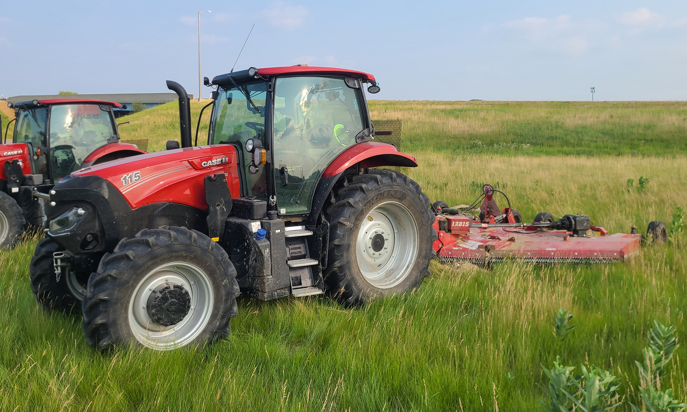{#fig:mower width=4in}

The tractors used consisted of Maxxum 115 and 125 tractors (Case IH, Racine, WI). Towed mowers were all various models of flex-wing rotary cutters, 15 feet (~4.5 m) in width (Brush Hog, Selma, AL). Up to four tractors were monitored at a time in 2023, and up to three were monitored at a time in 2024.

Operations were performed on roadways across many parts of the state of Indiana, including a range of different terrain conditions, varying from flat plains in the north and center of the state to more rugged hills in the south.

Two key pieces of equipment were used to monitor mowing operations: a telematics logging unit (see @Sec:methods_iso) and a timelapse camera (see @Sec:methods_camera). In the second year, one additional piece was added to the monitoring system: of a pair of remote GPS trackers (Apple, Cupertino, CA; and Samsung, Ridgefield Park, NJ), shown as callout `(1)` in @Fig:int24.

{#fig:int24 width=5in}

## Telematics Logging {#sec:methods_iso}
Telematics were logged using a Purdue ISOBlue system [@Balmos_IsoblueAvenaFramework_2022], shown in @Fig:ISOBlue. These systems record all messages on the attached CAN bus, time and location as received from GPS, and have the capability to be remotely accessed over a cellular data connection. These devices were chosen because they are open-source [@OatsCenter_IsoblueHardwareAvena_2023] and technical support was readily available from local colleagues. Logged data was stored in three SQL tables; one for GPS data, one for CAN data, and one for cellular data. The GPS table contained columns for timestamps, latitude, and longitude; all useful information for understanding the movement patterns of the associated machine. The CAN table contained columns for timestamps, network interface, message ID, and message data. Logged CAN messages included several useful kinds of information from the vehicle's internal computer systems, particularly including ground speed and power take-off (PTO) usage.

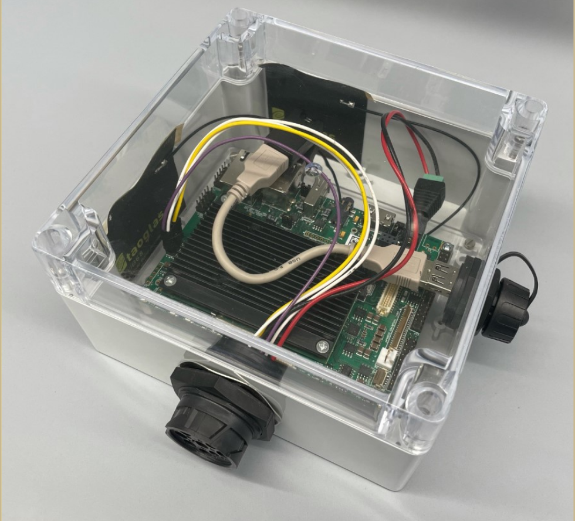{#fig:ISOBlue width=3in}

GPS data was recorded at a sample rate of 1 Hz, though no RTK was available for high-precision localization. To calculate the GPS speed of the monitored tractor, the distance between each consecutive coordinate pair was first calculated by the haversine method [@Deniau_CalculateDistance2_2024],a formula for calculating distance along the surface of a sphere. This distance was then divided by the difference between associated timestamps to find an estimate of the speed.

All CAN messages transmitted on each monitored tractor's ISOBUS were recorded to logs. The only messages used for this study were those with a parameter group number (PGN) of `FE43`, which contain data about the PTO used by the towed mower, and `FEF1`, which contains the vehicle's wheel speed. These two groups were extracted from the logs in order to characterize typical movement and work patterns, which was then analyzed in relation to other data and imagery recorded contemporaneously.

## Video Recording {#sec:methods_camera}
Timelapses were recorded using a Hero 8 Black action-sports camera (GoPro, San Mateo, CA). Cameras were positioned such that they would record a view of the towed mower and the vegetation surrounding it during operation, in order to capture both the machine's activity and the characteristics of its environment. Cameras were fitted with rugged metal motorsports frames, as shown in @Fig:camera, in order to provide a protective case and a reliable mount for use in harsh environments. These systems were flashed with an experimental firmware [@Newman_GoproLabs_2024] that allows recordings to be triggered programmatically in response to different conditions. GPS metadata was extracted from video timelapses using an open-source python program [@Casillas_Gopro2gpx_2023].

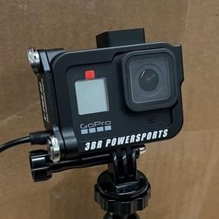{#fig:camera width=3in}

Cameras were originally triggered to record by "keyed" power (power only enabled when the tractor is switched on), with an additional delay provided to encourage recording only mowing operations, not any initial preparations. Keyed power was provided through a custom wire harness, which included a DC-DC converter to take in the tractor's 12V power and output 5V power for the camera's USB connector. Recording was programmed to stop automatically after keyed power was switched off.

In the configuration used first, Configuration #1, the program took wide-angle high-resolution (4K) photographs at a sample rate of 1 Hz, each saved as a separate file so that any possible corruption would affect only a single frame. This configuration used a delay of 30 minutes after keyed power was switched on, putting the camera to sleep for that duration, as a conservative estimate of the amount of time that might be spent after starting the engine but before beginning consistent mowing work. The logical flow of this configuration is summarized in @Fig:config1.

{#fig:config1 height=1.5in}

Configuration #2, which was the second one used during the 2023 season, recorded wide-angle videos at a sample rate of 1 Hz and a resolution of 1080p. Each instance of keyed power was recorded in its own file to allow video compression to reduce data storage requirements. This configuration also used a delay of 30 minutes, but it was split between 25 minutes of sleep and 5 minutes of idling in order to allow the camera time to fix on a GPS signal. The logic of this configuration is summarized in @Fig:config2.

{#fig:config2 height=1.5in}

Configuration #3, the most advanced configuration used during the 2023 season, recorded wide-angle videos at a sample rate of 1 Hz and a resolution of 1080p. Each instance of keyed power was recorded in its own file, as before. However, the 5-minute idle period was replaced by a GPS speed trigger, ensuring that the camera would not begin recording until it had obtained a GPS signal and could confirm that the tractor was moving. The logic of this configuration is summarized in @Fig:config3.

{#fig:config3}

To address shortcomings identified in Year 1 methods, new firmware configurations were developed for Year 2.

The final firmware configurations, hereafter collectively considered Configuration #4, revolved around two major changes: removing the camera battery, which allowed simple circuit physics to replace the software-based keyed power trigger, and saving the firmware configuration into nonvolatile memory so that settings were reliably retained during powered-off periods. The GPS-based speed trigger was retained from the third configuration shown in @Fig:config3, to encourage reliable GPS metadata in recorded videos. Additionally, the sleeping period was removed, such that even short periods of movement after power-on would be recorded. The logic of this configuration is summarized in @Fig:config4. The grace period for intermittent stops (hysteresis) was initially tested as 5 minutes, but later changed to 30 minutes (as is shown in the figure). The only change to the firmware configurations after that development was in enabling "large chapter support" so that very long videos would not be broken up into multiple smaller files.

{#fig:config4 height=2in}

Cameras were deployed at the start of the mowing season and memory cards were periodically rotated during operational periods. Remote tracking was not available in 2023, so monitored tractors were located each time by word-of-mouth from the mowing foreman. As this was found to be unreliable and difficult to organize, real-time GPS trackers were added for the 2024 season (see @Fig:int24) to simplify the logistics of maintenance and provide a real-time estimate of activity without going into the field.

## Validation Process {#sec:methods_val}
### Manual Reliability Testing
Cameras were manually tested in several conditions in order to verify the reliability of mounting hardware, system reboots, GPS positioning, and time synchronization under different system configurations. These tests were performed in order to quickly evaluate the different configurations without deploying them in the field, where longer time periods were necessary to wait for results and non-functional configurations would result in missing potential data.

Benchtop tests considered the power draw of the cameras in each configuration. Basic reliability and battery standby longevity could also be tested, though any tests requiring GPS motion would be tested as explained below.

A university-owned tractor working on row crops in a local field was used for initial tests of mounting hardware and camera firmware programmability. This allowed rapid testing in a similarly rugged and high-vibration environment before committing to long-term deployment on roadside equipment.

Each new camera configuration was also tested in both low-speed (less than about 5 mph, ~2.2 m/s) and high-speed travel (more than 10 mph, ~4.5 m/s). Low-speed travel was tested by carrying the camera on foot, to simulate the slow movement of a tractor actively mowing. High-speed travel was tested by carrying the camera on a bicycle or automobile, to simulate the faster movement of a tractor in transit between mowing sites.

All manual tests, regardless of travel speed, were evaluated using several binary metrics. The first was whether the system would automatically reactivate itself after both power-off and complete battery-drain. The second was whether the system could attach accurate GPS metadata, including date and time, to all recorded footage.

### Automated Reliability Testing
In order to allow rapid iteration on the camera configurations, replicable and quantitative measurements of camera reliability, and endurance tests of multiple reboots in sequence, some kind of controller test environment was desired. To fulfill this role, a robotic testing system was devised to simulate the changes in keyed power and tractor movement for an attached camera. The test system used a motorized boom to swing the camera in a wide circle---moving at a speed comparable to a tractor mowing in the field---and changes in movement patterns and simulated keyed power. The design of the machine and the test schedule are described below.

The requirements for the system were determined experimentally. The minimum radius was found by moving a camera in successively wider circles until it would reliably measure movement via GPS, and the final design was given a slightly longer boom than that for additional tolerance. 

#### Design of Automated Test System
The design of the robotic testing system is shown in @Fig:test. The motor used was rated for 250 Watts of continuous power, model number DRVASMB7120037 (Pride Mobility, Exeter, PA). The boom was made from aluminum square tubing, providing a movement radius of 2 meters so that the attached camera could reliably measure movement via GPS. The system was controlled by an ESP32 microcontroller, with firmware provided online [@Wiegman_MsThesisRepo_2025].

The initial design used a caster wheel to support the long arm, in order to prevent the weight of the boom and attached camera from applying too much lateral strain to the motor shaft. However, as the system was used in outdoor conditions (to most accurately simulate realistic mowing, and allow unobstructed GPS reception), uneven terrain under the wheel would cause the system to vibrate too violently when moving at full speed. The final version of the machine ended up using a counterweight at the opposite end of the arm, to allow the boom to spin freely in midair without need for support under the long arm. A photograph of the machine is shown in @Fig:test.

{#fig:test width=4.5in}

The electrical design of the system was straightforward. An ESP32 microcontroller was used to switch on power to the camera through a relay, and it communicated the desired movement speed to the motor through a Talon SRX motor controller (CTR Electronics, Macomb, MI). A block diagram of the system is shown in @Fig:electronics.

{#fig:electronics}

#### Automated Testing Schedule {#sec:schedule}
The most important metric for determining whether a camera configuration was effective was whether it began recording at the correct times. A simple schedule was devised to check if the camera would trigger reliably: five minutes "off", with the system not moving and the camera power disabled, alternating with periods of ten minutes "on", with the camera powered and in motion. Camera Configuration #4, as explained in @Fig:config4, was tested for a total of 11 cycles.

The videos recorded by the automatic schedule were checked for duration and GPS metadata. A cycle was qualitatively considered as "success" if the camera correctly detected movement and at some point started recording. The quantitative measure of success was the ratio of recording time to moving time.

## Video Processing {#sec:methods_video}
Visual recordings were analyzed by both manual review and computer vision programs. Manual reviewers watched all footage and noted how many obstacles were encountered, what kinds of obstacles were encountered, the nature of each encounter (successful avoidance, non-destructive touch, or destructive collision), as well as any unusual circumstances encountered [@Sprague_AnalyzingVideoIsobus_2024]. Two computer vision programs were used in order to quantify two different things: an instance segmentation model, which helped detect how much time the mower operated on road shoulders and lane surfaces, and a classification model, which helped identify interactions with obstacles and the circumstances in which they were encountered.

### Instance Segmentation
The first computer vision program was an instance segmentation model, trained based on mowing videos annotated by hand, largely performed by a colleague Nathan Sprague [@Sprague_ProgramAnnotateVideos_2024]. The model was based on YOLOv8-Seg [@Jocher_UltralyticsYolov8_2023] and segments were assigned one of twenty classes (with the most important being "road", "shoulder", "grass", and "mower"). The full list of possible classes is given in @Tbl:segments, and an example of a segmented image is shown in @Fig:segmented.

The instance segmentation results were post-processed to determine the mower's position relative to the road and shoulder. This was achieved by projecting the road and shoulder detections to the bottom edge of the image, and a pixel overlap calculation between the detected edge of the mower and these features allowed for objective and quantitative estimation of the mower's position relative to the road and shoulder.

|  ID | Name     |  ID | Name      |  ID | Name           |  ID | Name          |
| --: | :------- | --: | :-------- | --: | :------------- | --: | :------------ |
|   0 | Road     |   5 | -         |  10 | Shoulder       |  15 | Roadkill      |
|   1 | Grass    |   6 | Vehicle   |  11 | Drain          |  16 | Traffic Cone  |
|   2 | Mower    |   7 | Human     |  12 | Bridge Barrels |  17 | Mailbox       |
|   3 | Sign     |   8 | -         |  13 | Post           |  18 | Branches      |
|   4 | Building |   9 | Guardrail |  14 | Litter         |  19 | Cable Barrier |

: The classes available for polygons identified via image segmentation [@Sprague_ProgramAnnotateVideos_2024]. {#tbl:segments}

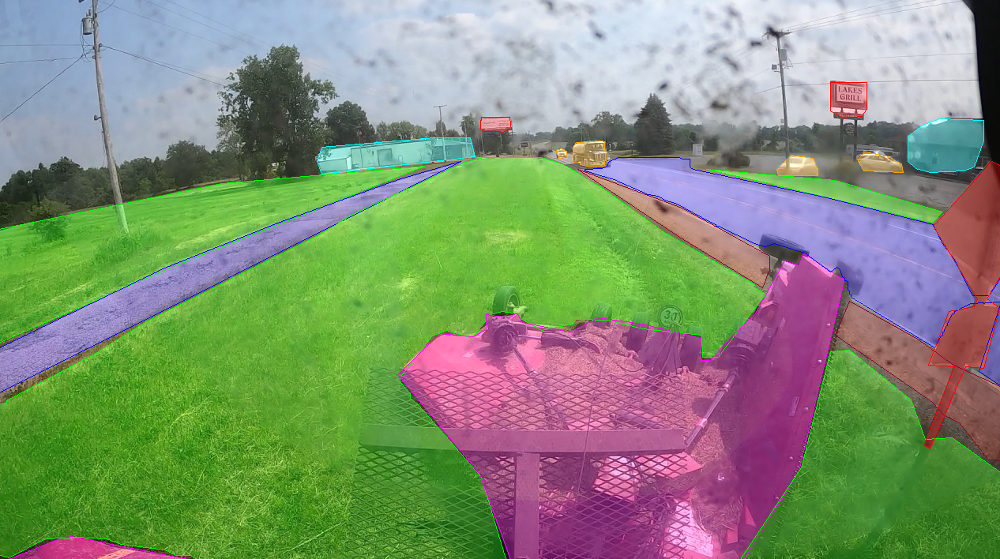{#fig:segmented height=3.5in}

### Classification Model
A complementary classification model was used to predict relevant labels directly from input images, without requiring instance segmentation. This model takes an image as input and will output labels indicating the mower's position relative to the shoulder or road, wing orientation, operation mode (normal mow, transit, maneuver), and obstacle type (if applicable). Initially, a binary classification approach was considered to classify the mower as "on" or "off" the road/shoulder. However, due to instances where the mower's position was ambiguous, this approach was not feasible. Instead, the model was trained to output a continuous value representing the distance of the mower from the edge of the road or shoulder, with positive values indicating on-road/shoulder position and negative values denoting off-road/shoulder position.

A specialized annotation tool [@Sprague_ProgramAnnotateVideos_2024] was used to integrate results from both the instance segmentation and the classification model, streamlining the annotation and manual verification process. The tool enabled automated video analysis, fast-forwarding to potential maneuver events detected by the classification model. Users could then review and edit specific details of each event, facilitating efficient annotation approximately four times faster than fully manual methods [@Mardikes_FutureRoadsideMowing_2025].

## Visual Odometry {#sec:methods_vo}
One significant expansion to the dataset would be a way to estimate the speed and distance traveled during a given timelapse recording. In the ideal case, the speed received from the GPS of the telematics system would be accurate, but no RTK corrections were available in this study. As a result, the speed values obtained as explained in @Sec:methods_iso are only rough estimates, and integrating them to find the total distance only compounds any associated errors and noise as the duration increases. Beyond that, as there may not be perfect overlap in uptime between the camera system and the other data collection modalities, metadata from ISOBUS is not guaranteed to be available for each and every timelapse recording. One possible way to get more accurate speed and distance estimates for the recorded timelapses would be to try extracting the information from the images themselves, a computer vision task called visual odometry (see @Sec:vo_lit).

A novel program for visual odometry was developed for this project. The architecture of the model was based on several found in the literature [@Wang_DeepvoTowardsEnd_2017; @Ye_PVOPanopticVisual_2023], simplified because it was specialized for the limited domain of roadside mowing timelapse imagery, in order to reduce training requirements. The model begins with basic feature extraction, using pre-trained depth estimation to help establish scale and distance in real space [@Yang_DepthAnythingV2_2024]. Another important part of feature extraction is the ResNet, a commonly used pre-trained classification model [@He_DeepResidualLearning_2015]. The pre-trained models for this section were used in order to avoid redundant training and avoid overfitting the large sections of the model to the limited domains exposed in the training data. Following the initial layers, a long-short-term-memory (LSTM) layer---with 8 nodes in each of the 4 internal cells---was used to help learn temporal relationships across input sequences, and linear layers combined all the extracted information to predict a single scalar value: the average movement speed for the input sequence. The model was trained end-to-end, rather than training each module for different parts of the pipeline separately, as is common in traditional VO systems, allowing the model to more implicitly learn the task [@Wang_DeepvoTowardsEnd_2017]. The tested architecture is summarized in @Fig:vo_arch.

{#fig:vo_arch}

Data was input to the model as sequences of 59 images, each sequence corresponding to one minute of mowing operations in real time. For each epoch, 923 sequences were used for training and 113 were used for testing. Training was performed for 50 epochs, with loss given by the mean square error (MSE) between the predicted speed and the ground-truth speed found from associated telematics data. The MSE was chosen for the loss function because it is appropriate for use with quantitative regression problems such as this one, and it more heavily penalizes larger errors, encouraging the model to converge to near the optimal values more quickly.  The ADAM optimizer was used to adjust model weights according to those calculated losses, as it is a commonly accepted optimizer in many computer vision tasks that is still advanced and effective for experimental training [@Reddi_ConvergenceAdam_2018].

An additional dataset, with a much higher sample rate (30 Hz) and a well-characterized speed distribution---collected by recording from the dashboard of an automobile traveling along a roadside at constant speed---was also used to train this model. That more tightly controlled dataset was used for validation, to confirm if the model could be trained for robustness across related domains, and to help understand the effect of sample rate on neural network VO. This additional dataset was split into 336 image sequences for training and 145 for testing. In order to encourage further development and project transparency, all code developed for this project is open-source and available online [@Wiegman_MsThesisRepo_2025].

\clearpage
# Results & Discussion
## Data Collection System Reliability {#sec:uptime}
### First Season (2023) {#sec:uptime_2023}
Monitoring of mowing operations suffered from poor uptime throughout the first year's deployment. An overview of the uptime for telematics, cameras, and both simultaneously is shown in @Fig:uptime_2023, derived from the GPS data recorded by both systems.

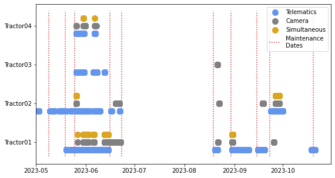{#fig:uptime_2023 height=2.5in}

As mentioned in the figure caption, the data collection system missed significant gaps throughout the season. The telematics loggers were the most reliable part of the system, as their only weakness was the occasional drop in GPS signal; otherwise they were almost always online and logging. There were only two noticeable gaps in the telematics coverage. The first is on Tractor02 in late August (where the cameras were working for a time without it), and this was not a failure of the recording system; that set of logs from the telematics systems was corrupted and lost after those monitored operations were successfully recorded. The second gap, on Tractor03 around the same period, is more mysterious. 

A flaw in the system was the inability for cameras to receive GPS signal reliably before beginning to record, which caused some recordings to save incorrect timestamps (off by multiple years, in some cases) or no GPS data at all---which would mean it could not be reliably time-synchronized with any other data. This was corrected mid-season by adding a GPS speed trigger to the program in Configuration #3 (see @Fig:config3), which required the GPS to obtain a signal and report the mower moving before the camera would begin recording. This added some latency to the startup, but greatly improved the quality of data recorded by the system, so it was considered a worthwhile trade-off.

The largest flaw in the system was the frequent failure of the camera systems to persist after more than a few days from installation or maintenance. The firmware configurations used at the time (Configurations #1-3) all relied on a software-based power-trigger that started with the tractor's keyed power, as explained in @Sec:methods_camera. The weakness of this configuration was that it is incompatible with automatic rebooting after power failure. As a result, whenever cameras ran completely out of battery between mowing sessions (verified in more detail in @Sec:manual_results) they would not automatically reboot into the same configuration upon being recharged by the tractor's power system. This resulted in the cameras functioning as expected for up to a few days, before running out of battery and not recording again until reset during maintenance. This is visible in @Fig:uptime_2023 as the tendency for the cameras (grey) to be present only for a short period after maintenance dates (red lines).

Another simple measure of uptime is the geographical coverage of the system throughout the season. @Fig:counties23 shows all counties in which GPS-synchronized data was recorded in 2023 on both camera and telematics simultaneously, as well as all counties in which partial, non-synchronized GPS data was recorded.

{#fig:counties23 height=3in}

### Second Season (2024)
The system was far more reliable in the second season, as many of the teething issues were characterized and solved during the off-season. An overview of the uptime for telematics, cameras, and both simultaneously is shown in @Fig:uptime_2024, derived from the GPS data recorded by both systems.

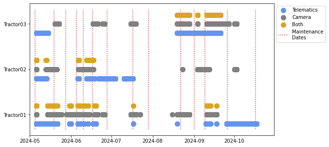{#fig:uptime_2024 height=2.5in}

There are some gaps in this coverage, albeit less than in 2023. In some cases (for example, Tractor02 in July), cameras did not record even though the telematics system recorded activity. Some of these were due to flaws in the human interface to the system; improperly anchored strain relief on some units meant that the camera's power cable could be disconnected if the operator opened the window too widely. Once this issue was identified, a more controlled strain relief mount---and some tape to reinforce any loose connections---was installed in all systems, and that particular issue was effectively prevented for the rest of the season.

Another human interfacing flaw identified during this season was that of the switched power connection to the tractor's electrical system. Due to the geometry of the connector and its placement in the cabin, it could be crushed by the operator's chair if positioned in a certain way. (The solution chosen for this problem was simply to remove the systems from tractors with especially tall operators---who needed their seats to be in the problematic positions---and re-deploy them in tractors with a more compatible operator.) As with the window problem, the chosen solution was able to prevent this issue from happening to the same system again. However, it must be acknowledged that this was only a stopgap solution. A more universal answer would be to use a specialized right-angle or low-profile connector that leaves proper clearance for the operator's seat.

Another simple measure of uptime is the geographical coverage of the system throughout the season. @Fig:counties24 shows all counties in which GPS-synchronized data was recorded in 2024 on both camera and telematics simultaneously, as well as all counties in which partial, non-synchronized GPS data was recorded.

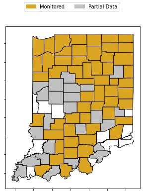{#fig:counties24 height=3in}

The conditions experienced throughout the mowing season are quite harsh on the equipment, explaining some of the failure rates observed in the results above. One hazard that is rarer but consistent (observed in both years) was that of debris launched up by the towed mower and back at the cabin. If given enough speed, even a small object can impart enough energy to shatter the window glass on which the camera is mounted, as is seen in @Fig:shatter.

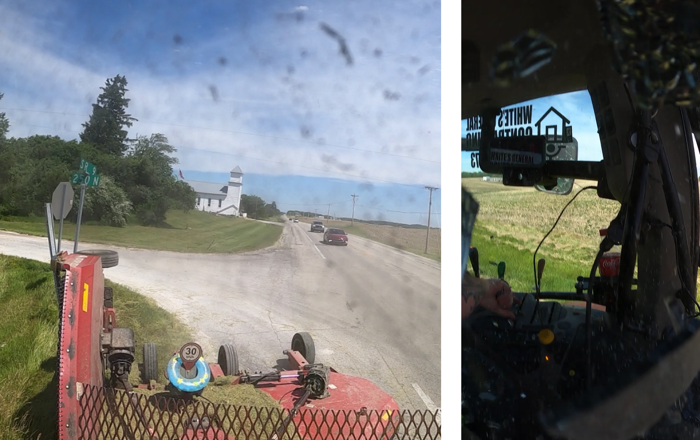{#fig:shatter width=5in}

### Year-to-Year Trends {#sec:conclude_yty}
A chart showing the difference in recording uptimes is shown in @Fig:uptime_hours, proving that the improved data collection protocols established for 2024 were an improvement on all fronts. The increased reliability was primarily due to a significantly improved camera configuration (improved uptime by an order of magnitude!). The process of developing that optimized procedure is given in @Sec:methods_camera. Otherwise, improvements in uptime from 2023 to 2024 came from a more aggressive maintenance schedule; as should be clear from the difference between @Fig:uptime_2023 and @Fig:uptime_2024, researchers went into the field to collect data significantly more often in the second season than in the first. This enabled more frequent error correction and more opportunities to notice potential problems sooner.

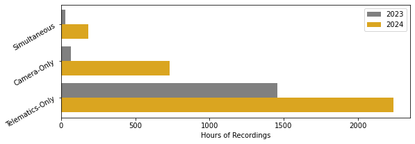{#fig:uptime_hours width=5in}

## On-Road Operations {#sec:road_time}
A significant risk factor for roadside workers is their proximity to traffic. Being close to fast-moving vehicles is dangerous, and being on the actual lanes for traffic (Zone 1) is even more so. To study the frequency with which professional tractor operators take on these risks, another measurement was taken of the proportion of mowing time spent with the mower extending onto the road surface, including the shoulder if not the actual road lanes. These measurements for 2023 and 2024, respectively, are shown in @Fig:shoulder23 and @Fig:shoulder24, segregated by road type in both cases.

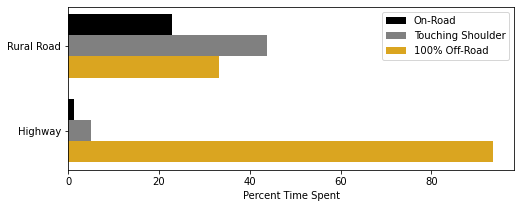{#fig:shoulder23 height=2.5in}

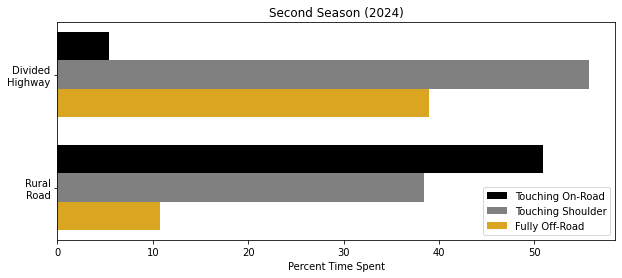{#fig:shoulder24 height=2.5in}

These show that tractor operators were much more likely to tow their mower on-road or at least on-shoulder on rural roads. A significant reason for this is the very narrow shoulder on many of those roads; there often is not enough space for the mower to physically fit entirely off-road. While the practice is still risky compared to staying off the road entirely, it should also be acknowledged that it is less risky on rural roads, where traffic is usually lower-speed and less frequent, than it would be on divided highways.

These results may inspire a change in operating procedures to encourage safer practices, or spur the development of new roadside vegetation control technologies that do not require such wide equipment that it cannot fit on narrow rural shoulders.

## Validation Process {#sec:results_val}
### Manual GPS Testing {#sec:manual_results}
Initial tests of basic mounting hardware and firmware programming performed on university-owned tractors led to two useful results. The first was that suction cup mounts were not reliable enough in the dusty, high-vibration environment of a working tractor, as all the units installed tended to fall down within hours or days of initial deployment. Adhesive-based mounts proved to be a much more robust option instead. Secondly, reconfiguring the camera firmware in the field proved to be fast and convenient enough to do onsite without disrupting the operators for any significant time, so cameras could simply have their memory card exchanged, their configuration updated, and redeployed on the spot: no need for changing out the entire camera unit.

A shortcoming of the GoPro platform chosen for this study is that it cannot charge its own battery while recording [@GoProSupport_HowChargeCamera_2023]. As a result, the battery will slowly drain even if the camera is connected to power. This was verified by connecting the camera through a USB power meter and measuring the average power draw in various situations. With no battery installed, the camera draws the same amount of power from the charger as it does with a partially-charged battery installed, suggesting that no additional power is drawn for charging the battery.

In initial firmware configurations, two major flaws were the inability to retain configuration after power loss and the lack of reliable GPS metadata, as mentioned in @Sec:uptime_2023. Manual tests were the primary method of iteration when discovering these problems and attempting to solve them.

After discovering that GPS metadata was unreliable, GPS speed trigger was added to the configuration (see @Fig:config3), which required the camera to obtain a GPS signal and report movement before it would begin recording. The GPS trigger was tested on foot, bicycle, and automobile to ensure that it functioned reliably at low, medium, and high speeds, and all GPS-triggered recordings successfully acquired a quality GPS signal before starting to record.

To solve the configuration-loss on power-loss issue, a more significant system architecture change was found necessary. There exists an option in the firmware to automatically reboot into a given configuration upon restoring power (`WAKE=2`), but this is incompatible with triggering the camera with keyed power. Keyed power, upon being switched on, changes the camera's input voltage from 0 to 5V in a single step. This provides one "rising edge" in the USB signal. If the camera is configured with `WAKE=2`, then that rising edge causes the camera to boot up from a powered off state. However, if the camera was configured to wait for USB power before *recording*, it would never record, because the voltage is already at the maximum of 5V and cannot "rise" to provide another rising edge signal. At the time that this flaw was discovered, the GPS speed trigger had already been in use, so it was decided to remove the power trigger entirely, and relying on the combination of the WAKE trigger and the GPS speed trigger.

To ensure that the camera started from the same WAKE state with each instance of keyed power, the battery was removed entirely: the cameras were run purely on keyed power. However, this meant that the cameras could not run any dynamic processes between powered-on periods, including the real-time clock (RTC) and periodically connecting to GPS. Having a regular connection to GPS aids the camera in quickly locking onto a full GPS signal when powered up; lacking this, it may take some time for the GPS to connect after powering on. While that problem was found insurmountable, the RTC problem was solved by adding a GPS time synchronization parameter to the firmware configuration (`MSYNC=1`), which resets the RTC on each boot-up with the time received from GPS. (While this feature is not officially listed as supported on the Hero 8 cameras used in this study, the configuration worked correctly in manual and automated testing, recording accurate timing metadata.)

### Automated Reliability Testing {#sec:test_rig_results}
The automated testing system was used to gather quantitative results about the camera triggering reliability and latency. A timeline of programmed movements and the corresponding recordings is shown in @Fig:rig_results.

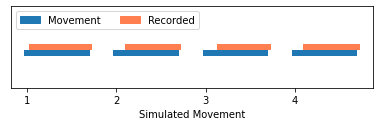{#fig:rig_results width=5.5in}

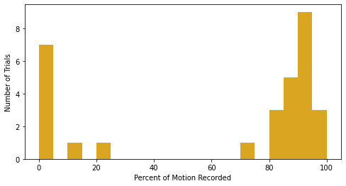{#fig:rig_capture}

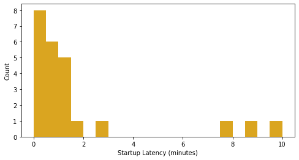{#fig:rig_latency}

After the many issues with power failures and GPS metadata in the 2023 mowing season, the automated test system was conceived as a way to automatically run camera firmware configurations through a lengthy battery of tests. The repeated power cycles and simple movements test the reliability of the new firmware; initial tests had difficulty triggering the camera at the correct times or after multiple power cycles, but the final firmware developed in this study was quite successful on the system, as stated in the @Fig:rig_results caption.

The movements in which the camera was late to record, or failed to record at all, were due to the camera failing to obtain a GPS signal and positively detect its movement. However, as shown in the movements which started recording late, the camera configuration was still flexible enough to start recording as soon as a good enough signal could be obtained, even if it was not directly correlated with the keyed power input. This adds some robustness to the system for long-term deployments in places that may have intermittent GPS signal, such as along roads with tunnels, steep cliffs, or heavy foliage overhead. The distribution of motion coverage is shown in @Fig:rig_capture, proving that the system tends to capture the full duration of events for which a strong movement signal is measured. The distribution of startup latency in recordings is shown in @Fig:rig_latency, which suggests that the system was quite reliable at beginning to record promptly after movement starts; long periods of undetected and unrecorded movements are rare.

## Obstacle Encounters {#sec:obstacles}
### First Season (2023)
Although limited data was collected in 2023, there was still enough to measure a significant number of encounters with many kinds of obstacles. The number of encounters with up to ten kinds of obstacles are shown in @Fig:obs23r and @Fig:obs23h for rural roads or highways, respectively.

Posts (a catch-all category for any narrow vertical obstacles that were not road signs) and signs were the most common obstacles by far, with more posts in highway environments and more signs along rural roads. Mailboxes were quite common along rural roads but absent on highways.

In all cases, operators were generally successful in maneuvering around obstacles without touching them. In the situations where the mower made contact with an obstacle, most of the time the obstacle was left without any permanent damage (only "touched"). However, a small but quantifiable number of situations ended with the mower permanently damaging the obstacle (the darkest bars in @Fig:obs23r and @Fig:obs23h). While these are regrettable, this provides an effective baseline level of performance for normal human operators performing conventional roadside vegetation control.

This data could be useful for comparing against other vegetation control systems, including autonomous mowing robots, as a benchmark that should be met or exceeded before implementation. Additionally, this data shows which classes of obstacles are more common than others; new systems could prioritize development towards handling the most common kinds of obstacles first.

### Second Season (2024)
The number of encounters with up to ten kinds of obstacles are shown in @Fig:obs24r and @Fig:obs24h for rural roads or highways, respectively. While the distribution of obstacles did not change to any incredible degree, note that these plots consider obstacle encounters from a significantly larger dataset (more hours of operations) than the previous year's.

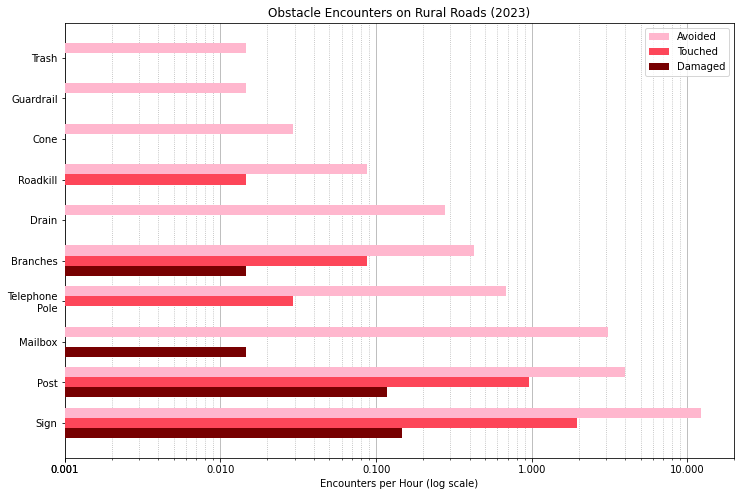{#fig:obs23r width=6in}

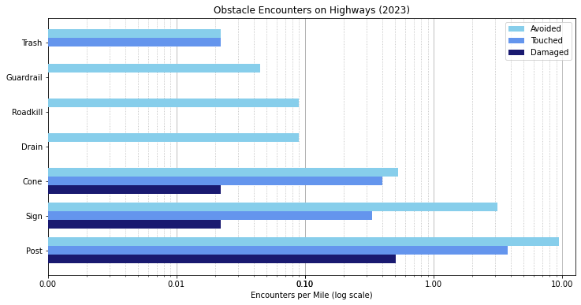{#fig:obs23h width=6in}

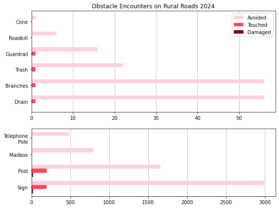{#fig:obs24r width=6in}

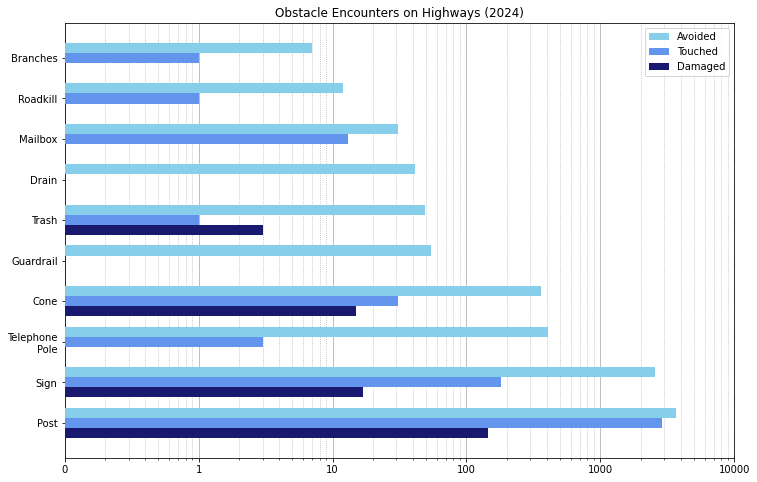{#fig:obs24h width=6in}

## Visual Odometry {#sec:results_vo}
After 50 epochs of training on real timelapse image sequences recorded in the 2024 season, the model was able to converge on a rough approximation of the correct values, as shown in @Fig:vo_timelapse. The model's predictions gave mixed results, with significant noise and error in some cases, though the overall distribution of predictions resembles that of the ground truth values. However, estimated values were noisy and unpredictable, only weakly predictive of the true speed. An interesting feature of the model lies in the "floor" observable in the predicted outputs. Since the predicted speed never strayed below about 2 m/s, it seems that a strong bias was learned in the fully-connected layers near the end of the model. 

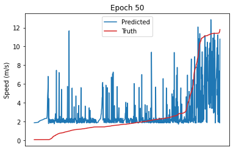{#fig:vo_timelapse height=3in}

This performance is quite poor compared to state-of-the-art results found in the literature. Purely monocular VO is a challenging computer vision task, less commonly done effectively compared to methods that use stereo cameras, panoptic imaging, LIDAR, or other sensor augmentations. However, some success *has* been reported in the literature before [@HerreraGranda_MonocularVisualSlam_2024], so this should not be an impossible task. The model was later trained on the validation data set, as explained in @Sec:methods_vo, for 10 epochs, and the results are shown in @Fig:vo_val.

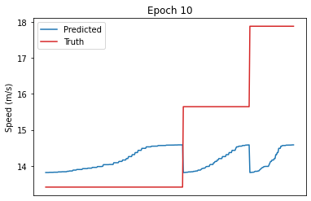{#fig:vo_val height=3in}

This process also shows quite poor performance, similar or worse to that of @Fig:vo_timelapse. As this was trained on normal, high-framerate sequences, this suggests that the problem does not necessarily lie in any specific intractability inherent to timelapse data. Several possible sources of error seem likely upon further reflection, but testing further would require more time and resources than are available at present. A lack of complexity in the model architecture itself may have been a large source of error for this process; the architecture summarized in @Fig:vo_arch was deliberately simplified and condensed compared to that of the most performant models in the literature in order to reduce its computational and memory requirements. A more sophisticated model architecture may allow a more effective model to be trained for this subject. Another, more specific potential problem with the tested model lies in the LSTM layer; relatively small LSTM layers were used, including only 8 cells, each with 4 hidden nodes. Particularly if combined with a lack of requisite complexity earlier in the stack, it may have been unrealistic to expect the model to effectively extract the correct information into only that space. While LSTM layers tend to run slowly and require relatively heavy computational loads, those used in this model were unidirectional and therefore should scale up to moderate sizes without excessive load. Alternatively, a simpler kind of temporally-dependent layer could be used in place of the LSTM, such as a Gated Recurrent Unit (GRU) or Temporal Convolutional Network (TCN), which require less computational resources than LSTM layers do.

\clearpage
# Conclusion
## In-Field Data Collection Processes {#sec:conclude_data}
The roadside mowing environment is a very challenging one in which to collect data. Monitoring equipment must be able to withstand harsh swings in temperature, direct sunlight, high risk of moisture and dust ingress, heavy vibration, and even high-velocity debris collision, as shown in @Fig:shatter. For these reasons, action-sports cameras are recommended when photographs or video recordings are desired. The GoPro cameras used in this study were impeccably robust in terms of physical resilience (at least twice they outlived the windows to which they were attached!). Additionally, the Labs firmware [@Newman_GoproLabs_2024] enabled a very flexible system for programming deterministic behavior, allowing advanced configurations for adaptability to a wide array of image collection tasks. For logging telematics, most standard agricultural units should be effective. The roadside is not significantly harsher in terms of environmental conditions than the farm field, so equipment that is designed for general agricultural use should be equally effective for use in roadside mowing.

The fundamental nature of roadside work means that all but the most short-term of experiments must be sent on long journeys, often through remote locations and sometimes across rugged terrain. This adds risks to the data collection process; when the system encounters some kind of fault, there are not necessarily guarantees of prompt service. To manage this condition, it is recommended to configure systems to automatically recover from faults whenever possible. However, such a simple solution is hardly foolproof or holistic in and of itself. Another way to control for the potential of interruptions in data collection is to schedule regular check-ins. As noted in @Sec:conclude_yty above, part of the reason that the system from this project improved in reliability in the 2024 season was the fact that the maintenance schedule included significantly more frequent hands-on interactions with the monitoring equipment. Any time that the systems failed for some reason, having a prompt check-in to notice and remedy the problem reduced total system downtime, preventing any gaps in data collection from growing too severe.

## Evidence-Based Mowing Standards {#sec:conclude_mow}
The primary metrics for mower performance that came from this study revolve around the rate of encounters with obstacles and the proportion of mowing time spent in the Zone 1 (paved road surface). The most accurate estimate of human operators' obstacle encounter rates on Indiana roads is likely to be @Fig:obs24h and @Fig:obs24r, as they are based on analysis of significantly more operating hours than the first season's results provided. These two plots show that human mower operators make contact with obstacles as frequently as 8 times per hour, and they cause permanent damage to obstacles at rates of up to 0.4 times per hour. Likewise, @Fig:shoulder23 and @Fig:shoulder24 show that human operators spend as little as 10% of their time fully off-road on rural routes, and as little as 40% of their time fully off-road on divided highway routes. Therefore, future roadside vegetation management technologies need only meet those basic standards in order to have quantitatively equivalent performance to human-operated mowers. It is likely that future technologies---such as autonomous roadside mowers---could even perform significantly better than those minimum standards, which would lead to greater safety for the public and reduced outlay on property damage: major improvements to the process of roadside vegetation control as a whole.

# Future Work
The results of the analysis of collected data, as shown particularly in @Sec:obstacles, provide a much clearer understanding of the typical challenges faced by mower operators in Indiana, in addition to proving the robustness of the data collection methods outlined in this document. Simulations of the roadway environment, such as @Mardikes_ConstructingDigitalTwin_2025, could use these obstacle encounter rates to more accurately model the rate at which different obstacles are likely to appear. Additionally, this information has been provided to INDOT, and they may be able to use it to better prioritize their safety communications and make other policy decisions based on a more accurate and up-to-date understanding of the real-world roadside mowing environment and associated typical mower operator behavior. Finally, the novel research problem of effectively estimating visual odometry from timelapse data remains unsolved, though a refinement of the methods attempted here with a more sophisticated architecture and/or additional computational resources may be a relatively simple path to acceptable performance.

\clearpage
# References
