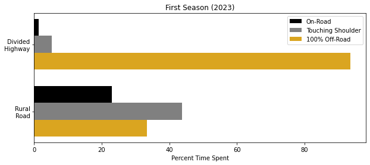

\doublespacing \linenumbers
\clearpage
# Introduction {#sec:intro}
[This chapter will clearly define the research problem and the motivation for research.]

## Thesis & Goals
[This section will clearly explain the central thesis and goals of the paper. It will draw a direct line from the initial problem to the final answer proved in this document.]

**Programmable action-sports cameras and standard agricultural telematics loggers can be used to record useful data about roadside mowing operations for understanding current operations and informing future developments.** This study describes a project in which a data collection process was developed to meet the following goals:

 1. Characterize real-world mowing environments on Indiana roadways.
 2. Identify challenges encountered by mowers on Indiana roadways.
 3. Quantify mower behaviors and responses to encountered conditions.

\clearpage
# Background
[This chapter will demonstrate understanding of the subject and all associated literature.]

## Roadside Mowing
[This section will provide a deep literature review of roadside mowing, identifying typical methods, its purpose, importance, and the unique challenges inherent to the work.]

### Right-of-Way Vegetation
[This section will explain the reasons vegetation is tolerated in right-of-way spaces. It will also provide a review of the types of vegetation found in these environments in Indiana.]

Controlling roadside vegetation is an important part of infrastructure maintenance. While the plants can perform important functions such as noise and erosion control, out-of-control vegetation can reduce visibility, obscure signage, and even damage road surfaces [@Milton_HandbookRoadEcology_2015; @Johnson_BestPracticesHandbook_2008]. For these reasons, keeping roadside vegetation present but trimmed to a reasonable level throughout the right-of-way is required for the safety and longevity of a road system.

### Conventional Vegetation Management
[This section will explain the current vegetation management strategies used in Indiana. It will also review the strengths and weaknesses of these policies.]

The most commonly used methods today are a combination of mowing and spot-application of conventional chemical herbicides [@Herold_IntegratedVegetationManagement_2014; @Nemec_HowEngineersRoadside_2022].

### Other Vegetation Management Technologies
[This section will describe alternative technologies for vegetation management. It will review the strengths and weaknesses of these options, and explain why they are not used in Indiana.]

Many different technologies can be used to manage roadside vegetation. Beyond conventional mowing and herbicides, there exists mulching, application of alternative organic herbicides, burning [@Barker_AlternativeManagementRoadside_2009], and even exotic technologies like infrared radiation [@Burnham_NonChemicalMethods_2003].

### Autonomous Mowers
[This section will provide a deep literature review of autonomous mowing, explaining why it would be a useful extension to conventional vegetation management and what technologies would be necessary to develop before it could be viable.]

## Agricultural Telematics Logging
[This section will provide a deep literature review of telematics logging in agricultural, industrial, and related contexts. It will discuss the rugged environment in which these activities take place, and explain how common equipment for these fields is designed to handle the conditions.]

### Geospatial Data
[This section will describe the types of geospatial data recorded by modern telematics systems. It will explain the capabilities of different kinds of GPS technologies and review the strengths and weaknesses of typical systems.]

### Embedded Computer Systems
[This section will describe the types of controller networks typical to modern tractors (i.e. ISOBUS) and the machine data that can be recorded from them. It will explain the way that CAN messages are encoded and decoded, and probably a small passive-aggressive rant about the lack of standards compliance among major manufacturers.]

## Video Activity Recording
[This section will provide a deep literature review of video activity recording in agricultural, industrial, and related contexts.]

### Operator-Facing Video Capture
[This section will describe the typical uses of cameras pointed into the tractor cabin. It will outline the kinds of information that can be gleaned from these recordings and explain why they are not as useful for the thesis put forth above.]

### Implement-Facing Video Capture
[This section will describe the typical uses of cameras pointed out of the tractor cabin. It will outline the kinds of information that can be gleaned from these recordings and explain why they would be useful for the thesis put forth above.]

### Long-Term Reliability in Rugged Environments
[This section will explain the environmental and operational constraints that inform camera selection. It will describe why research-grade equipment is not rugged enough to be reliable in the field over long periods. It will also contrast the typical use-case of dash-cameras with those used in a long-term study such as this one.]

\clearpage
# Methods
[This chapter will clearly describe the appropriate research methods and tools developed and used for this study.]

## Year 1 
The first studied mowing season lasted from May 2023 through October 2023. Initial prototypes of data collection systems were tested in the months leading up to the start of the season, and collection procedures were further developed in multiple iterations throughout the year. Mowing operations were performed by INDOT contractors with privately owned equipment, as shown in @Fig:mower.

The tractors used consisted of Maxxum 115 and 125 tractors (Case IH, Racine, WI). Towed mowers were all various models of flex-wing rotary cutters 15 feet in width (Brush Hog, Selma, AL). Up to three tractors were monitored at a time.

Operations were performed on roadways across many parts of the state of Indiana, including a range of different terrain conditions, varying from flat plains in the center of the state to more rugged hills in the south. A map of Indiana counties in which operations took place is shown in @Fig:counties.

{#fig:mower width=5in}

{#fig:counties height=3in}

### Telematics Logging {#sec:methods_iso}
Telematics were logged using a Purdue ISOBlue system [@Balmos_IsoblueAvenaFramework_2022], shown in @Fig:ISOBlue. These systems record all messages on the attached CAN bus, time and location as received from GPS, and have the capability to be remotely accessed over a cellular data connection. These devices were chosen because they are open-source [@OatsCenter_IsoblueHardwareAvena_2023] and technical support was readily available from local colleagues. Logged data was stored in three SQL tables; one for GPS data, one for CAN data, and one for cellular data. The GPS table contains columns for timestamps, latitude, and longitude. The CAN table contains columns for timestamps, network interface, message ID, and message data.

{#fig:ISOBlue width=3in}

GPS data was recorded at a sample rate of 1 Hz. To calculate the ground speed of the monitored tractor, the haversine method [@Deniau_CalculateDistance2_2024] was used to find the distance between each consecutive coordinate pair, and this was divided by the difference between associated timestamps to get the speed.

All CAN messages transmitted on each monitored tractor's ISOBUS were recorded to logs. The only messages used for this study were those with a parameter group number (PGN) of FE43 and FEF1, which contain data about the power take-off (PTO) used by the towed mower.

### Video Recording {#sec:methods_camera}
Timelapses were recorded using a Hero 8 Black action-sports camera (GoPro, San Mateo, CA). Cameras were mounted in rugged metal motorsports frames, as shown in @Fig:camera. These systems were flashed with an experimental firmware [@Newman_GoproLabs_2024] that allows recordings to be triggered programmatically in response to different conditions. Cameras were triggered to record by "keyed" power (power only enabled when the tractor is switched on), with an additional delay provided to encourage recording only mowing operations, not any initial preparations. Keyed power was provided through a custom wire harness, which included a DC-DC converter to take in the tractor's 12V power and output 5V power for the camera's USB connector. Recording was programmed to stop automatically after keyed power was switched off.

{#fig:camera width=3in}

In the configuration used first, the program took wide-angle high-resolution photographs at a sample rate of 1 Hz, each saved as a separate file so that any possible corruption would affect only a single frame. This configuration used a delay of 30 minutes after keyed power was switched on, putting the camera to sleep for that duration. The logic of this configuration is summarized in @Fig:config1.

{#fig:config1 height=1.5in}

The second configuration used during the 2023 season recorded wide-angle videos at a sample rate of 1 Hz and a resolution of 1080p. Each instance of keyed power was recorded in its own file to allow video compression to reduce data storage requirements. This configuration also used a delay of 30 minutes, but it was split between 25 minutes of sleep and 5 minutes of idling in order to allow the camera time to fix on a GPS signal. The logic of this configuration is summarized in @Fig:config2.

{#fig:config2 height=1.5in}

The third and most advanced configuration used during the 2023 season recorded wide-angle videos at a sample rate of 1 Hz and a resolution of 1080p. Each instance of keyed power was recorded in its own file, as before. However, the 5-minute idle period was replaced by a GPS speed trigger, ensuring that the camera would not begin recording until it had obtained a GPS signal and could confirm that the tractor was moving. The logic of this configuration is summarized in @Fig:config3.

{#fig:config3}

GPS metadata was extracted from video timelapses using an open-source python program [@Casillas_Gopro2gpx_2023].

Cameras were deployed at the start of the mowing season and memory cards were rotated every two weeks during operational periods. Remote tracking was not available, so monitored tractors were located each time by word-of-mouth from the mowing foreman.

### Video Processing {#sec:methods_video}
Visual recordings were analyzed by both manual review and computer vision programs. Manual reviewers watched all footage and noted how many obstacles were encountered, what kinds of obstacles were encountered, the nature of each encounter (successful avoidance, non-destructive touch, or destructive collision), as well as any unusual circumstances encountered [@Sprague_AnalyzingVideoIsobus_2024]. Two computer vision programs were used in order to quantify two different things: an instance segmentation model, which helped detect how much time the mower operated on road shoulders and lane surfaces, and a classification model, which helped identify interactions with obstacles and the circumstances in which they were encountered.

#### Instance Segmentation
The first computer vision program was an instance segmentation model, trained based on mowing videos annotated by hand [@Sprague_ProgramAnnotateVideos_2024]. The model was based on `YOLOv8-Seg` [@Jocher_UltralyticsYolov8_2023] and segments were assigned one of twenty classes (with the most important being "road", "shoulder", "grass", and "mower"). The full list of possible classes is given in @Tbl:segments, and an example of a segmented image is shown in @Fig:segmented.

The instance segmentation results were post-processed to determine the mower's position relative to the road and shoulder. This was achieved by projecting the road and shoulder detections to the bottom edge of the image, and a pixel overlap calculation between the detected edge of the mower and these features allowed for objective and quantitative estimation of the mower's position relative to the road and shoulder.

|  ID | Name     |  ID | Name      |  ID | Name           |  ID | Name          |
| --: | :------- | --: | :-------- | --: | :------------- | --: | :------------ |
|   0 | Road     |   5 | -         |  10 | Shoulder       |  15 | Roadkill      |
|   1 | Grass    |   6 | Vehicle   |  11 | Drain          |  16 | Traffic Cone  |
|   2 | Mower    |   7 | Human     |  12 | Bridge Barrels |  17 | Mailbox       |
|   3 | Sign     |   8 | Gravel    |  13 | Post           |  18 | Branches      |
|   4 | Building |   9 | Guardrail |  14 | Litter         |  19 | Cable Barrier |

: The classes available for polygons identified via image segmentation [@Sprague_ProgramAnnotateVideos_2024]. {#tbl:segments}

{#fig:segmented height=3.5in}

#### Classification Model
A complementary classification model was used to predict relevant labels directly from input images, without requiring instance segmentation. This model takes an image as input and will output labels indicating the mower's position relative to the shoulder or road, wing orientation, operation mode (normal mow, transit, maneuver), and obstacle type (if applicable). Initially, a binary classification approach was considered to classify the mower as "on" or "off" the road/shoulder. However, due to instances where the mower's position was ambiguous, this approach was not feasible. Instead, the model was trained to output a continuous value representing the distance of the mower from the edge of the road or shoulder, with positive values indicating on-road/shoulder position and negative values denoting off-road/shoulder position.

A specialized annotation tool [@Sprague_ProgramAnnotateVideos_2024] was used to integrate results from both the instance segementation and the classification model, streamlining the annotation and manual verification process. The tool enabled automated video analysis, fast-forwarding to potential maneuver events detected by the classification model. Users could then review and edit specific details of each event, facilitating efficient annotation approximately four times faster than fully manual methods.

## Validation Process
### Manual Reliability Testing
Cameras were manually tested in several conditions in order to verify the reliability of system reboots, GPS positioning, and time synchronization under different system configurations. These tests were performed in order to quickly evaluate the different configurations without deploying them in the field, where longer time periods were necessary to wait for results and non-functional configurations would result in missing potential data.

Benchtop tests considered the power draw of the cameras in each configuration. Basic reliability and battery standby longevity could also be tested, though any tests requiring GPS motion would be tested as explained below.

Each new camera configuration was tested in both low-speed and high-speed travel. Low-speed travel was tested by carrying the camera on foot, to simulate the slow movement of a tractor actively mowing. High-speed travel was tested by carrying the camera on a bicycle or automobile, to simulate the faster movement of a tractor in transit between mowing sites.

All manual tests, regardless of travel speed, were evaluated using several binary metrics. The first was whether the system would automatically reactivate itself after both power-off and complete battery-drain. The second was whether the system could attach accurate GPS metadata, including date and time, to all recorded footage.

### Automated Reliability Testing
Camera configurations were also evaluated using a robotic test rig. The automated system allowed replicable, quantitative measurements of reliability in conditions similar to field deployment. The test rig used a motorized boom to swing the camera in a wide circle, simulating the movement of a tractor mowing in the field, and would change movement patterns and simulated keyed power according to the programmed schedule. The design of the machine and the test schedule are described below.

The requirements for the rig were determined experimentally. The minimum radius was found by moving a camera in successively wider circles until it would reliably measure movement via GPS, and the final design was given a slightly longer boom than that for additional tolerance. 

#### Test Rig Design
The design of the robotic test rig is shown in @Fig:test. The motor used was rated for 250 Watts of continuous power, model number DRVASMB7120037 (Pride Mobility, Exeter, PA). The boom was made from aluminum square tubing, providing a movement radius of 2 meters. The system was controlled by an ESP32 microcontroller, with firmware provided in [CITATION].

The initial design used a caster wheel to support the long arm, in order to prevent the weight of the boom and attached camera from applying too much lateral strain to the motor shaft. However, as the system was used in outdoor conditions (to most accurately simulate realistic mowing, and allow unobstructed GPS reception), uneven terrain under the wheel would cause the system to vibrate too violently when moving at full speed. The final version of the machine ended up using a counterweight at the opposite end of the arm, to allow the boom to spin freely in midair without need for support under the long arm. A photograph of the machine is shown in @Fig:test.

{#fig:test width=4.5in}

The electrical design of the system is straightforward. An ESP32 microcontroller was used to switch on power to the camera through a relay, and it communicated the desired movement speed to the motor through a Talon SRX motor controller (CTR Electronics, Macomb, MI). A block diagram of the system is shown in @Fig:electronics.

{#fig:electronics}

#### Automated Testing Schedule {#sec:schedule}
The most important metric for determining whether a camera configuration is effective is whether it begins recording at the correct times. A simple schedule was devised to check if the camera would trigger reliably: five minutes "off", with the test rig not moving and the camera power disabled, alternating with periods of five minutes "on", with the camera powered and in motion. The final camera configuration, explained in @Sec:methods_camera2, was tested for a total of 11 cycles.

The videos recorded by the automatic schedule were checked for duration and GPS metadata. A cycle was qualitatively considered as "success" if the camera correctly detected movement and at some point started recording. The quantitative measure of success was the ratio of recording time to moving time.

## Year 2
[This section will explain the materials and processes used in 2024 in detail.]

The second studied mowing season lasted from May 2024 through October 2024. Data collection systems and procedures were based on a refinement of those from the previous year. Mowing operations were performed by INDOT contractors with privately owned equipment, as shown in @Fig:mower.

The tractors used consisted of Maxxum 115 and 125 tractors (Case IH, Racine, WI). Towed mowers were various models of flex-wing rotary cutters 15 feet in width (Brush Hog, Selma, AL). Up to three tractors were monitored at a time. Additional equipment was added to the monitoring system compared to the previous year: of a pair of remote GPS trackers (Apple, Cupertino, CA; and Samsung, Ridgefield Park, NJ), shown as callout `(1)` in @Fig:int24.

{#fig:int24 width=5in}

Operations were performed on roadways across many parts of the state of Indiana, including a range of different terrain conditions, varying from flat plains in the center of the state to more rugged hills in the south. A map of Indiana counties in which operations took place is shown in @Fig:counties2.

{#fig:counties2 width=3in}

### Telematics Logging
[This section will explain the ISOBlue and the data recorded with it. It will explain the details used in processing the recordings.]

Telematics were logged using a Purdue ISOBlue system [@Balmos_IsoblueAvenaFramework_2022], as discussed in @Sec:methods_iso. GPS data was recorded at a sample rate of 1 Hz. To calculate the ground speed of the monitored tractor, the haversine method [@Deniau_CalculateDistance2_2024] was used to find the distance between each consecutive coordinate pair, and this was divided by the difference between associated timestamps to get the speed.

All CAN messages transmitted on each monitored tractor's ISOBUS were recorded to logs. The only messages used for this study were those with a parameter group number (PGN) of FE43 and FEF1, which contain data about the power take-off (PTO) used by the towed mower.

### Video Recording {#sec:methods_camera2}
[This section will explain the GoPro and configuration settings used in 2024. It will also describe the process used to develop the configurations found.]

Timelapses were recorded using a Hero 8 Black action-sports camera (GoPro, San Mateo, CA), mounted in rugged metal motorsports frames and flashed with an experimental firmware [@Newman_GoproLabs_2024], as discussed in @Sec:methods_camera. To address shortcomings identified in Year 1 methods, new firmware configurations were developed for Year 2.

The final firmware configurations mostly revolved around two major changes: removing the camera battery, which allowed simple circuit physics to replace the software-based keyed power trigger, and saving the firmware configuration into nonvolatile memory so that settings were reliably retained during powered-off periods. The GPS-based speed trigger was retained from the third configuration explained in @Sec:methods_camera, to encourage reliable GPS metadata in recorded videos. Additionally, the sleeping period was removed, such that even short periods of movement after power-on would be recorded. The logic of this configuration is summarized in @Fig:config4. The grace period for intermittent stops (hysteresis) was initially tested as 5 minutes, but later changed to 30 minutes (as is shown in the figure). The only change to the firmware configurations after that development was in enabling "large chapter support" so that very long videos would not be broken up into multiple smaller files.

{#fig:config4 height=2in}

### Video Processing
[This section will explain the video annotation methods used in 2024. It will provide detailed explanations of the AI and manual review process.]

Visual recordings were analyzed by both manual review and computer vision programs, much the same as explained in @Sec:methods_video. More sophisticated computer vision programs were developed for analyzing the larger dataset, open-source and available online [@Sprague_ProgramAnnotateVideos_2024].

\clearpage
# Results
## Year 1
[This section will present the data gathered in 2023 and identify basic trends.]

### Data Collection System Uptime
[This section will show the percentage uptime for each component of the original data collection system, as well as the uptime of the system as a whole, during the 2023 season.]

### Obstacle Collisions
[This section will identify the obstacles encountered in 2023 and note which were most common, which were most often damaged, and so forth.]

{#fig:obstacles_2023 height=3.5in}

### On-Road Operations
[This section will note how long the mowers spent on-shoulder and on-road during operation. It will also mention how long was spent in transit (on-road and not operating).]

{#fig:shoulder_2023 height=3in}

## Validation Process
[This section will present the data gathered by the test rig and other validation protocols.]

### Manual GPS Testing
[This section will note which configurations were able to most reliably record with GPS metadata. It will also identify which configuration options were necessary to correct flaws.]

|   Mode    | Average Power Draw (W) |
| :-------: | :--------------------: |
|   Idle    |          1.8           |
| Recording |          2.1           |

: GoPro power draw as measured on the benchtop. There was no significant difference in power draw for each category between camera configurations, though full-speed video was not tested in this study.

{#fig:manual_results height=2.5in}

### Automated Reliability Testing
[This section will give the system uptime of the test-rig runs for each tested configuration.]

{#fig:rig_results width=5.5in}

## Year 2
[This section will present the data gathered in 2024 and identify basic trends.]

### Data Collection System Uptime
[This section will show the percentage uptime for each component of the original data collection system, as well as the uptime of the system as a whole, during the 2024 season.]

{#fig:shatter width=5in}

### Obstacle Collisions
[This section will identify the obstacles encountered in 2024 and note which were most common, which were most often damaged, and so forth.]

### On-Road Operations
[This section will note how long the mowers spent on-shoulder and on-road during operation. It will also mention how long was spent in transit (on-road and not operating).]

\clearpage
# Conclusion
[This chapter will provide effective analysis of the results presented above, and demonstrate the theoretical and applied significance of the findings published here.]

## Year-to-Year Trends
[This section will compare the 2023 and 2024 data sets, comparing and contrasting the results.]

## Evidence-Based Mowing Standards
[This section will present quantitative standards that autonomous mowers must meet in order to match the performance of human-operated equipment.]

## In-Field Data Collection Processes
[This section will summarize the challenges presented by the unique conditions found in professional roadside mowing. It will then recommend the types of technologies best suited for studying activities in these conditions and explain how those technologies meet the associated environmental and administrative requirements.]

\clearpage
# References
