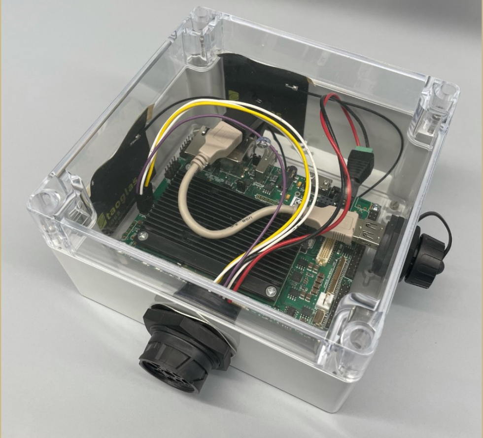
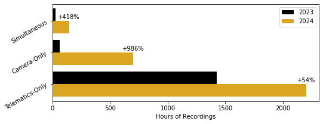
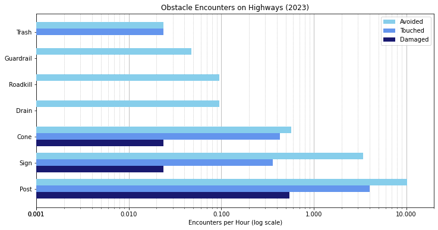
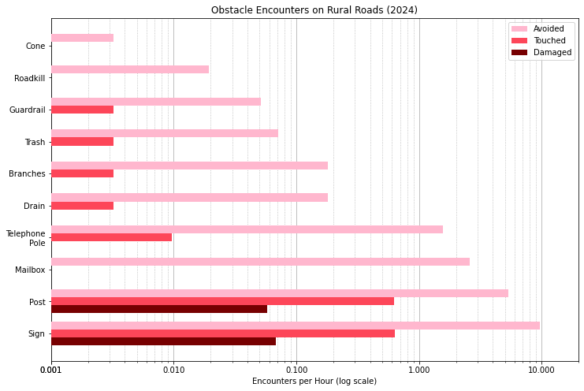
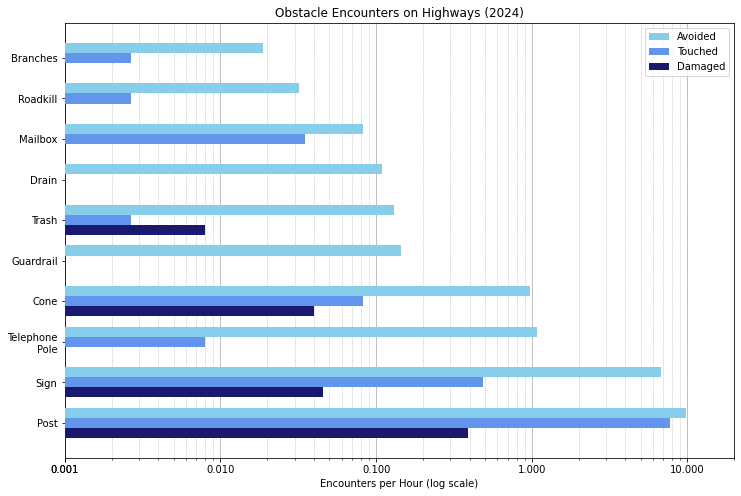
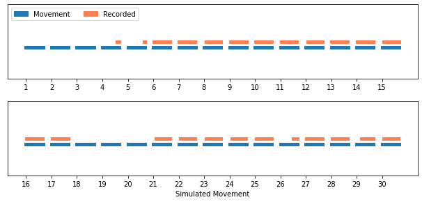

\doublespacing \linenumbers
\clearpage
# Introduction {#sec:intro}
The purpose of this chapter is to define the research problem and the motivation for research. It will provide context for understanding and clearly state the central thesis and goals of the rest of the document.

## Project Context
In Indiana, thousands of miles of state roads are flanked by vegetation and require regular mowing and other maintenance in order to remain safe and effective for public traffic. Currently, this maintenance is performed with large mowers towed by tractors and teams of pedestrian workers with handheld trimmers. While this maintenance routine is functional, it is expensive and labor-intensive, and it exposes workers to serious safety risks as they work adjacent to high-speed traffic. The Indiana Department of Transportation (INDOT) is interested in autonomous mowers as a potential technology for reducing the risks and costs associated with that work. This project aims to quantify the performance of the current-day human-operated mowing regime in order to characterize the requirements for and feasibility of future autonomous machines for roadside mowing.

## Thesis & Goals
**Programmable action-sports cameras and standard agricultural telematics loggers can be used to record useful data about roadside mowing operations for understanding current operations and informing future developments.** This study describes a project in which a data collection process was developed to meet the following goals:

 1. Characterize real-world mowing environments on Indiana roadways.
 2. Identify challenges encountered by mowers on Indiana roadways.
 3. Quantify mower behaviors and responses to encountered conditions.

Additional research is also indicated for developing appropriate computer vision systems to support the project goals, as large volumes of visual data must be collected to effectively study this topic.

\clearpage
# Background
The purpose of this chapter is to provide the reader with background knowledge necessary to understand the broader project outlined in the prior chapter. @Sec:veg gives an overview of roadside vegetation and the various technologies and protocols used to manage its growth. @Sec:telematics covers telematics logging in relevant industries and explains several of the challenges inherent to such data collection in the context of roadside mowing. Penultimately, @Sec:var discusses the use of cameras to record visual data about machine activity and the environment and decisions faced by equipment operators during roadside mowing operations. The final @Sec:visual_odo gives a brief introduction to *visual odometry,* a computer vision task focused on estimating the speed of and distance traveled by a photographed moving object.

## Roadside Mowing {#sec:veg}
The purpose of this section is to provide a deep literature review of roadside vegetation and its management. The importance and multifaceted functions of the vegetation itself is given in @Sec:row_veg. A discussion on available management methods, both conventional and alternative options, is given in @Sec:veg_management. The unique challenges of the work, and an explanation of why novel technologies are necessary, are given in @Sec:new_tech.

### Right-of-Way Vegetation {#sec:row_veg}
Vegetation is a common fixture along roads all throughout Indiana and much of the United States. Roadside vegetation can serve many functions, and different configurations can offer different trade-offs for their effects on the environment, road traffic, and safety. A major function of vegetation in right-of-way spaces is erosion control [@Milton_HandbookRoadEcology_2015], as bare soil will often wash out during preciptation and deposit large quantities of sediment downstream [@Richardson_PracticesErosionControl_1970; @Bochet_FactorsControllingVegetation_2004; @Baets_ImpactRootArchitecture_2007; @Wang_OptimizingRoadsideSlope_2024]. Roadside vegetation can also help control multiple types of pollution. It can reduce the total amount of water runoff, preventing contaminants from directly washing deeper into the watershed [@Wang_OptimizingRoadsideSlope_2024], and automotive dust particles containing heavy metals like cadmium, lead, nickel, and zinc can be captured by roadside trees and other leafy plants [@SzyszlakBarglowicz_FunctionRoadsideVegetation_2013], preventing the fine particulate matter [@Ozdemir_MitigationImpactRoadside_2019] and other types of air pollution [@Tong_RoadsideVegetationBarrier_2016] from drifting far from the roadway. Noise pollution, too, is reduced by roadside vegetation [@Reethof_EffectPlantingsRadiation_1973], even relatively small barriers [@Kalansuriya_EffectRoadsideVegetation_2009]. In addition, planting natural scenery along roadsides can have psychological effects on passing drivers, potentially reducing stress and crash rates [@Fitzpatrick_InfluenceClearZone_2014] and affecting drivers' speed and lane-centering behavior [@Calvi_DoesRoadsideVegetation_2015]. Beyond that, species chosen for these roles need not be the purely utilitarian options that are often chosen, such as non-native grasses and trees. Using beautiful plants for the task, such as native wildflowers, can improve the aesthetic appeal of the roadside environment without compromising on their functions [@Dana_WildflowersIndianaHighways_1996; @Isaacs_MaximizingArthropodMediated_2009; @Ebbers_EstablishmentWildflowerIslands_2024], though sometimes native plants may require multiple seasons to become fully established [@Herold_IntegratedVegetationManagement_2014; @Barnes_NativeWarmSeason_2000]. Additionally, roadside vegetation can provide habitats for many organisms in the local ecosystem, and changes to the vegetation can have significant ecological impacts [@Forman_RoadEcology_2002; @Valko_RoadsideGrasslandRestoration_2023], so the choice of plant species and how they are maintained should be chosen with careful regard to their effects on local wildlife [@Ryu_QuantifyingBenefitsRoadside_2025].

However, controlling that roadside vegetation is an important part of infrastructure maintenance. While the plants perform many important functions, as explained in detail above, poorly controlled vegetation can reduce visibility, affect snow accumulation, cause sudden changes in wind pressure [@KocurBera_RoadsideVegetationSafety_2015], obscure signage, and damage road surfaces [@Johnson_BestPracticesHandbook_2008; @Milton_HandbookRoadEcology_2015]. For these reasons, keeping roadside vegetation present but trimmed to a reasonable level throughout the right-of-way is critical to ensuring the safety and longevity of a road system.

### Vegetation Management {#sec:veg_management}
The most commonly used methods today are a combination of mowing and chemical herbicides [@Herold_IntegratedVegetationManagement_2014; @Nemec_HowEngineersRoadside_2022]. The Indiana Department of Transportation (INDOT) divides road right-of-way into four zones for vegetation management purposes: Zone 1 is the paved road surface, Zone 2 is the clear zone (for safety purposes), Zone 3 is the selective zone (where only invasive weeds and woody vegetation are removed), and Zone 4 is the outer zone (where only invasive weeds and hazardous tree species are removed) [@FHAOPDER_VegetationManagementToolbox_2015]. The current practice, as recommended by @Herold_IntegratedVegetationManagement_2014, is to mow the clear zone, typically with large flex-wing mowers, and apply selective herbicides to the entire clear zone on a carefully prescribed schedule to minimize its effects on desired grasses while maximizing its effects on unwanted vegetation. The selective zone and outer zone receive herbicide only in spot treatments directly at unwanted plants, not wide-area sprays. Near the edges of obstacles and along steep slopes, mechanical mowing is manually performed with string trimmers, as the heavy equipment used elsewhere cannot access such areas [@Nemec_HowEngineersRoadside_2022].

One vegetation management strategy that has been adopted somewhat more recently in INDOT policy is the use of native prairie grasses in place of non-native roadside vegetation. These have been shown to resist droughts and require less maintenance once established [@Herold_IntegratedVegetationManagement_2014], though some studies have found that other nearby species may share genes or otherwise compete with the planted species in later seasons [@Li_SuccessionalEstablishmentMowing_2008]. As native species are supremely well-adapted to the local climate and soil conditions, they effectively defend against weeds, protect sensitive areas, and reduce ecosystem impacts [@Steinfeld_RoadsideRevegetationIntegrated_2007]. A mixture of native species that occupy different ecological niches are recommended, in order to outcompete weeds in all respects. When established in such a manner, native plants tend to require little to no herbicidal treatments, and often require less frequent mowing than artificially introduced species, leading to significantly lower management time and cost requirements in the long run [@Barnes_NativeWarmSeason_2000; @ODell_NativeRoadsidePerennial_2007].

Mowing and chemical herbicides are effective and commonly used throughout the United States for roadside vegetation control, as they can be performed effectively at a reasonable cost. However, there are some concerns with the practice; frequent mowing tends to favor the growth of short, sod-forming grasses [@Li_SuccessionalEstablishmentMowing_2008]. It also upsets the natural succession of roadside species, as it unnaturally disrupts the distribution of light and nutrients, in addition to culling a larger proportion of taller plants than shorter ones [@Ryu_QuantifyingBenefitsRoadside_2025]. Likewise, there are ecological concerns with the use of herbicides, especially when sprayed indiscriminately in wide areas, as is often the most cost-effective method. Overuse can even contribute to agrochemical runoff, a common water pollution concern, and some kinds of herbicides are more broadly toxic than others. As a result, the use of more efficient and environmentally friendly herbicides is recommended over broad-spectrum options [@Li_SuccessionalEstablishmentMowing_2008]. Investing in more native re-vegetation projects, which have a higher upfront cost but require less mowing and less herbicide in later seasons, as discussed in more detail above, is one of the most effective solutions to the environmental concerns expressed here. It continues to be pursued as a long-term priority, but deploying the strategy takes time and not every roadside is perfectly suited for it, so it is not yet omnipresent on Indiana roadways.

Beyond conventional mowing and herbicides, there exist several other technologies for vegetation management. Research has been done on the possibility of using mulching or applying alternative organic herbicides [@Barker_AlternativeManagementRoadside_2009], and even exotic technologies like infrared radiation [@Burnham_NonChemicalMethods_2003], but these are not commonly used in Indiana due to their inferior performance and higher cost compared to the standard mowing and chemical treatments discussed previously. One unusual management strategy that could be used in the state is controlled burning. This is most effective in areas that have been replanted with native tall-grass prairie species, as these plants are naturally adapted to surviving periodic brush fires. Such fires can help clear detritus and allow more light to reach slower-growing tall-grasses climbing up from the prairie floor, while most undesired plants have difficulty surviving the brief but intense flames. Prescribed burns can therefore be used to preferentially support the native prairie plants while simultaneously removing invasive weeds and woody brush species [@Brandt_IntegratedRoadsideVegetation_2015].

### Safety Requirements and Autonomous Mowers {#sec:new_tech}
A key risk in roadside maintenance of any kind is the exposure of workers to traffic. This can prove to be dangerous for both the maintenance workers and road travelers in the event of a collision or other accident, potentially resulting in expensive property damage and injuries or even fatalities [@Mardikes_ConstructingDigitalTwin_2025]. As a result, mechanical mowing has been called "the most hazardous" vegetation control method, and it is associated with high costs due to insurance requirements and property damage outlays [@Hyman_BestManagementPractices_1999]. However, large, slow-moving mowers continue to be used because all known alternatives require too much manual labor, environmental impact, or are otherwise logistically infeasible. Given the currently available alternatives, the current strategy generally scores quite well on balancing six key factors: worker safety, public safety, environmental impact, herbicide use, cost and efficiency, and public perception [@TeeterBalin_FeasibilityAlternativeVegetation_2006]. Novel technologies and solutions must be developed in order to improve beyond this status quo.

One technology under development that might address the concerns above is autonomous mowing robots. Adopting robotic mowers would remove the equipment operators from direct exposure to the roadside, protecting them from proximity to traffic and potentially limiting the total number of maintenance workers required to be onsite in the first place [@Arsenault_AutonomousMowingImproving_2010]. Additionally, autonomous mowers could be deployed as a fleet of smaller robots working in concert, rather than as a one large machine. This would present less of a distraction than larger equipment might [@Creed_ImplementationValidationObstacle_2011] and reduce the severity of any collisions, as an accident involving any one small robot would be far less destructive than a collision with the monolithic heavy equipment that is currently used instead [@Mardikes_AutonomousRoadsideMowing_2023].

Autonomous mowers exist on the market today, but they are not suitable for roadside operations. These devices can trace their history to advances built upon remote-controlled mowers in the early 2000s [@Chavez_StudyObjectDetection_2009], such as the Danish research robot CASMOBOT (**C**omputer **A**ssisted **S**lope **Mo**wer Ro**bot**), which explored the basics of driver-assist technology in the leadup to its completion in 2009. CASMOBOT, and similar machines that followed, performs "semi-automatic" mowing, in which a human operator manually drives the machine to set a perimeter around the target area, and then the machine automatically covers all area inside that perimeter. Initial devices in this vein required full-time human supervision, as they did not have any capability for real-time obstacle avoidance [@Jensen_ComputerAssistedSlope_2009]; modern commercial machines are capable of automatically avoiding detected hazards. However, these devices are not yet trustworthy enough for fully autonomous operation, as they can only achieve an acceptable safety rating by maintaining a berth of approximately ten feet (~3 m) from plot edges and all detected obstacles [@Mardikes_ConstructingDigitalTwin_2025]. Given that the clear zone to be mowed along Indiana roadsides (see @Sec:veg_management) is typically 30 feet (~9 m) wide, and often even narrower on rural roads, such limited machines would not be effective for roadside mowing operations.

In order to significantly contribute to right-of-way mowing operations, future autonomous machines must be capable of safely and reliably mowing all the way to the edge of the clear zone, which would put them directly adjacent to active traffic. Another way to significantly contribute to improving roadside mowing would be to replace the workers who manually trim vegetation around the edges of smaller obstacles in the right-of-way, such as signs, guard rails, and streetlamps or utility poles, as large mowing equipment is not precise enough around the bases of those objects. As such, future autonomous machines will need robust edge-following capabilities in order to mow along the edge of either the clear zone or the smaller obstacles discussed above. However, no quantitative measurement has been published to describe the necessary performance at that task in order to match human operators. This thesis aims to gather data that can provide insight on this question, giving quantitative evidence for recommended requirements.

## Agricultural Telematics Logging {#sec:telematics}
The purpose of this section is to provide a deep literature review of telematics logging for agricultural machinery and related systems. Telematics refers to the collection and transmission of metadata about machine function and operations. The measurement of geospatial data, particularly location and velocity of monitored equipment, is covered in @Sec:GIS. Data available from computer systems embedded in modern machinery and other heavy equipment, as well as the methods for interfacing with and decoding the signals from those computer systems, is covered in @Sec:embedded.

### Geospatial Data {#sec:GIS}
Geospatial information systems are a critical technology enabling modern agricultural operations. Managing vegetation, whether in fields or along roadsides, always requires knowing where the vegetation is located, and having effective telematics information such as the amount of time that operations spend working on a given area can enable significant planning improvements and efficiency gains [@Skliar_IncreasingPerformancePark_2021]. Geospatial position is measured in the United States through the Global Positioning System (GPS), a type of Global Navigation Satellite System (GNSS). When GPS location is paired with a well-calibrated real-time kinematic (RTK) base station, position can be measured with extremely high precision---to the level of one centimeter---even in rugged terrain [@Marucci_PrecisionFarmingHilly_2017]. As precise timing is an intrinsic part of how any GNSS works [@HofmannWellenhof_GnssGlobalIntroduction_2008], any telematics system that can measure a GPS location can also obtain a very accurate time for each measurement. When the locations are tracked over time, the speed of the telematics system can be determined by simple calculus: the speed is equal to the change in distance for each unit time. Unfortunately, the speed extrapolated from GPS position tends to be noisy, so more effective estimates of speed are often given directly by the GPS sensor, which can accurately measure its own velocity in real-time based on the Doppler shift of signals received from GPS satellites [@HofmannWellenhof_GnssGlobalObservables_2008].

High-precision GPS-RTK location measurements are extremely effective, generally reliable, and relatively straightforward to obtain. However, the technology does have a few potential drawbacks to be aware of. High-quality GPS receivers that can measure position to high accuracy are not inexpensive, which may limit their adoption in certain cases, and the extreme precision enabled by RTK base stations are only available when a given telematics unit has consistent access to the RTK corrections published in real-time. If connectivity with the telematics system is intermittent or unreliable, the levels of precision and accuracy offered by RTK may be unavailable. That said, even non-RTK GPS systems are often still relatively accurate on modern receivers, and they are sufficient to keep accurate time and give a good estimate of the unit's overall location and general movement patterns.


### Embedded Computer Systems {#sec:embedded}
Modern agricultural machines are often built with sophisticated telematics systems embedded directly from the manufacturer [@Krzyzaniak_UseTelematicsSystems_2022]. Such systems can provide a wide array of different capabilities, including management of a diesel engine and hydraulic transmission, control of any attached implement(s), setting passenger comfort and climate control configurations, tracking geolocation and providing navigation assistance, and even radio communications [@Goltyapin_GlobalTrendsDevelopment_2020]. However, these built-in systems are typically designed to only interface with the manufacturer's proprietary telematics software, with limited ability to extract data outside that ecosystem [@Thomasson_ReviewStateArt_2018]. Many of these systems are connected inside a piece of equipment via a "controller area network" (CAN) bus, which allows all nodes in the network to communicate with all other nodes bilaterally when needed. The most common specification used in agricultural equipment is called ISOBUS, a stricter protocol that is built atop CAN, designed to be as robust and straightforward as possible [@Brodie_BuzzwordIsobus_2023].

ISOBUS enables connecting a wide variety of different kinds of agricultural equipment together, sharing data between the various nodes in the system's embedded network and allowing additional functionality when the appropriate kinds of equipment are attached [@Brodie_BuzzwordIsobus_2023]. One of the most important parts of the vehicle to be monitored with this system is the engine, and the messages submitted to the network by the engine's control unit can report information like the temperature and shaft speed, the vehicle's odometer reading, and the wheel speed. Messages in the ISOBUS system are sent according to the SAE J1939 standard that was originally developed by the automotive industry. J1939 messages are delivered in atomic *CAN frames,* each of which contains a data payload, a parameter group number (PGN) that recipients can use to know how to decode the payload properly, and a source address to identify the sender, as there may be many devices all attached to the same bus [@Pietikaeinen_RemoteIsobusTelematics_2014]. While the J1939 standard recommends several encoding schemes for common kinds of data, not all equipment manufacturers follow those specifications when encoding the data payload attached to CAN frames broadcast by their devices. Significant reverse-engineering efforts may be required to figure out the proper methods to interpret nonstandard CAN messages, but the process is usually feasible---meanings are typically hidden only by obscurity, not serious encryption.

The electronics hardware that provides the aforementioned embedded computer systems is usually delicate on its own. Agricultural operations like roadside mowing often require working in very rugged conditions, with heavy vibrations, dust and water ingress, strong solar exposure, and high temperatures. As a result, ISOBUS devices are recommended to require locking, weather-sealed connectors, sturdy cables, and carefully considered mechanical design and material choices in order to effectively withstand such conditions [@Pietikaeinen_RemoteIsobusTelematics_2014].

## Video Activity Recording {#sec:var}
The purpose of this section is to provide a literature review on the use of video recording technology for understanding agricultural and industrial activity patterns. The utility of using cameras to record human operators and their interactions with their equipment is examined in @Sec:operator_video. The utility of using cameras to record equipment activity during operations is examined in @Sec:mow_video. Finally, a discussion on the environmental and reliability requirements for video recording in agricultural contexts is given in @Sec:rugged_video.

### Operator-Facing Video Capture {#sec:operator_video}
A common method for studying operator behavior in human factors engineering is to place a camera inside the cabin, recording the operator's interactions with the equipment controls [@Buchholz_ErgonomicsErgonomicAssessment_1997; @Grandi_DesignErgonomicDashboards_2022]. This technique can allow measurement of several metrics, such as working posture, repetitive motions, reaction time, and even certain biometrics, as well as calculated indices for the level of stress and strain that different movements tend to put on parts of the body [@Lowe_ErgonomicsAssessmentMethods_2019; @Greene_VisualizingStressfulAspects_2017; @Valero_MusculoskeletalDisordersConstruction_2016; @Cocca_AssessmentBiomechanicalRisk_2008]. While some of these methods can offer a peripheral view into understanding the decisions that operators make [@Grandi_DesignErgonomicDashboards_2022], most are focused purely on the ergonomics of work actions. That is to say, all commonly used methods developed for analyzing equipment operator video were designed only to identify the operators' exposure to risk factors for physical stress and potential injury [@Greene_VisualizingStressfulAspects_2017]. Another potential application for operator-facing imaging equipment is in fatigue recognition [@Zhang_DevelopmentRescueSystem_2018] and distraction recognition [@Moslemi_ComputerVisionBased_2021], which are also likewise not directly applicable to mowing performance quantification. Without relying on separate sensors, none of these techniques can offer any significant insight into work performance or task completion: key metrics that this study aims to measure for the purposes of informing autonomous vehicle requirements. As a result, operator-facing video capture is not considered an effective tool for this study.

### Implement-Facing Video Capture {#sec:mow_video}
A different use of video recording technology is to take images of the surrounding environment or work being performed by the machine. Several adaptations of this technology exist in the agricultural space; a prominent example is the camera-guided herbicide sprayer, which can autonomously target weed species [@Moeller_ComputerVisionVersatile_2010], provide row alignment assistance [@Maheshwary_LowCostEmbedded_2023], and quantify movement through crop fields [@Stanhope_ApplicationsLowCost_2016]. Several other applications for implement-facing imaging equipment have been developed as well, including implement and activity recognition [@ANQilin_LightweightRepvitBased_2025] and coverage deployment rate [@Luo_DevelopmentApplicationRemote_2022].

As the previous paragraph notes, implement-facing video capture is well-suited to measuring the performance characteristics of agricultural operations. When properly configured, it should be possible for an imaging system to measure movement along the roadside, quantify obstacle encounters, and recognize activity patterns in recorded operations. These kinds of metrics are what are necessary to understand current roadside mowing operations and informing the requirements for future technologies to match contemporary human performance.

### Long-Term Reliability in Rugged Environments {#sec:rugged_video}
The cabin of a tractor used for roadside mowing operations is a very rugged environment. The work is performed regularly throughout the spring, summer, and fall seasons, in a wide array of weather conditions. Temperatures can swing widely, sun exposure can be extreme, and high levels of humidity, moisture, and (especially) dust are very common in the atmosphere. Vibrations are often significant if not severe, and monitoring equipment may even need to withstand ballistic exposure to mower-launched debris *(aside: see @Fig:shatter)*. As a result, lab-grade equipment is completely inappropriate for instrumenting activities in this environment, even though research-oriented instruments would bring a convenient level of configurability. Two other categories of video recording equipment were considered for this project: automotive dash cameras and extreme-sports action cameras.

Automotive dash cameras meet most of the appropriate robust construction requirements, as automobiles can face extreme temperature variations and such cameras are expected to survive (if not necessarily fully intact) most accidents or collisions for evidence collection purposes. However, consumer dash cameras lack the environmental sealing necessary for roadside mowing, as they are designed to stay within the much better-sealed cabin of on-road vehicles. Additionally, they tend to be designed only for continuous recording at high framerate, overwriting old data whenever they run out of storage, as the primary purpose is to document unexpected events; manual data retrieval is expected to occur immediately thereafter. That is not acceptable for a long-term monitoring system as needed for this project, as data from all periods during the study is equally important.

While action-sports cameras are not designed to be wired directly into a vehicle's electrical system like dash cameras, they are designed to withstand the extreme conditions of motorsports, nature exploration, and other highly rugged environments. In addition, as they are general-purpose photography and videography devices, they are capable to being configured with various different settings that are unavailable on dash cameras, such as timelapses, and they can even be set to automatically begin recording in response to certain stimuli. Due to the aforementioned advantages, action-sports cameras were found to be the most appropriate class of equipment for video monitoring of roadside mowing operations.

## Visual Odometry {#sec:visual_odo}
The purpose of this section is to provide a brief literature review on the topic of visual odometry, a computer vision task. A survey of modern techniques is providede in @Sec:vo_lit, and the novel challenges faced in attempting to perform visual odometry on data from this project are explained in @Sec:vo_mow.

### Common Visual Odometry Methods {#sec:vo_lit}
[This section will describe existing state-of-the-art in visual odometry techniques. It will primarily cover the powers and capabilities of monocular video, but some explanations will be offered for the lack of stereo cameras and similar inputs in this project.]

### Visual Odometry for Roadside Mowing {#sec:vo_mow}
[This section will explain how the visual odometry challenges posed by this project are novel and noteworthy, and provide background for the architectural choices explained in the sections below.]


\clearpage
# Methods
The purpose of this chapter is to clearly describe the appropriate research methods and tools developed and used for this study. The equipment, environment, and basic logistics of the mowing operations monitored are explained in @Sec:methods_mow. The equipment and recording procedures for the telematics collected from monitored tractors are explained in @Sec:methods_iso. The camera and the process of developing the proper settings and configuration for visual activity recordings are explained in @Sec:methods_camera. The processes used to validate the camera's reliability are explained in @Sec:methods_val, and the method of analyzing recorded videos is explained in @Sec:methods_video. The process of attempting to develop a visual odometry system for use on the datasets collected in this project is documented in @Sec:methods_vo.

## Mowing Operations {#sec:methods_mow}
The first studied mowing season lasted from May 2023 through October 2023. Initial prototypes of data collection systems were tested in the months leading up to the start of the season, and collection procedures were further developed in multiple iterations throughout the year. The second studied mowing season lasted from May 2024 through October 2024. Data collection systems and procedures were based on a refinement of those from the previous year. All mowing operations were performed by INDOT contractors with privately owned equipment, as shown in @Fig:mower.

{#fig:mower width=4in}

The tractors used consisted of Maxxum 115 and 125 tractors (Case IH, Racine, WI). Towed mowers were all various models of flex-wing rotary cutters, 15 feet (~4.5 m) in width (Brush Hog, Selma, AL). Up to four tractors were monitored at a time in 2023, and up to three were monitored at a time in 2024.

Operations were performed on roadways across many parts of the state of Indiana, including a range of different terrain conditions, varying from flat plains in the north and center of the state to more rugged hills in the south.

Two key pieces of equipment were used to monitor mowing operations: a telematics logging unit (see @Sec:methods_iso) and a timelapse camera (see @Sec:methods_camera). In the second year, one additional piece was added to the monitoring system: of a pair of remote GPS trackers (Apple, Cupertino, CA; and Samsung, Ridgefield Park, NJ), shown as callout `(1)` in @Fig:int24.

{#fig:int24 width=5in}

## Telematics Logging {#sec:methods_iso}
Telematics were logged using a Purdue ISOBlue system [@Balmos_IsoblueAvenaFramework_2022], shown in @Fig:ISOBlue. These systems record all messages on the attached CAN bus, time and location as received from GPS, and have the capability to be remotely accessed over a cellular data connection. These devices were chosen because they are open-source [@OatsCenter_IsoblueHardwareAvena_2023] and technical support was readily available from local colleagues. Logged data was stored in three SQL tables; one for GPS data, one for CAN data, and one for cellular data. The GPS table contains columns for timestamps, latitude, and longitude. The CAN table contains columns for timestamps, network interface, message ID, and message data.

{#fig:ISOBlue width=3in}

GPS data was recorded at a sample rate of 1 Hz. To calculate the ground speed of the monitored tractor, the haversine method [@Deniau_CalculateDistance2_2024] was used to find the distance between each consecutive coordinate pair, and this was divided by the difference between associated timestamps to get the speed.

All CAN messages transmitted on each monitored tractor's ISOBUS were recorded to logs. The only messages used for this study were those with a parameter group number (PGN) of FE43 and FEF1, which contain data about the power take-off (PTO) used by the towed mower.

## Video Recording {#sec:methods_camera}
Timelapses were recorded using a Hero 8 Black action-sports camera (GoPro, San Mateo, CA). Cameras were mounted in rugged metal motorsports frames, as shown in @Fig:camera. These systems were flashed with an experimental firmware [@Newman_GoproLabs_2024] that allows recordings to be triggered programmatically in response to different conditions. GPS metadata was extracted from video timelapses using an open-source python program [@Casillas_Gopro2gpx_2023].

{#fig:camera width=3in}

Cameras were originally triggered to record by "keyed" power (power only enabled when the tractor is switched on), with an additional delay provided to encourage recording only mowing operations, not any initial preparations. Keyed power was provided through a custom wire harness, which included a DC-DC converter to take in the tractor's 12V power and output 5V power for the camera's USB connector. Recording was programmed to stop automatically after keyed power was switched off.

In the configuration used first, the program took wide-angle high-resolution photographs at a sample rate of 1 Hz, each saved as a separate file so that any possible corruption would affect only a single frame. This configuration used a delay of 30 minutes after keyed power was switched on, putting the camera to sleep for that duration. The logic of this configuration is summarized in @Fig:config1.

{#fig:config1 height=1.5in}

The second configuration used during the 2023 season recorded wide-angle videos at a sample rate of 1 Hz and a resolution of 1080p. Each instance of keyed power was recorded in its own file to allow video compression to reduce data storage requirements. This configuration also used a delay of 30 minutes, but it was split between 25 minutes of sleep and 5 minutes of idling in order to allow the camera time to fix on a GPS signal. The logic of this configuration is summarized in @Fig:config2.

{#fig:config2 height=1.5in}

The third and most advanced configuration used during the 2023 season recorded wide-angle videos at a sample rate of 1 Hz and a resolution of 1080p. Each instance of keyed power was recorded in its own file, as before. However, the 5-minute idle period was replaced by a GPS speed trigger, ensuring that the camera would not begin recording until it had obtained a GPS signal and could confirm that the tractor was moving. The logic of this configuration is summarized in @Fig:config3.

{#fig:config3}

To address shortcomings identified in Year 1 methods, new firmware configurations were developed for Year 2.

The final firmware configurations mostly revolved around two major changes: removing the camera battery, which allowed simple circuit physics to replace the software-based keyed power trigger, and saving the firmware configuration into nonvolatile memory so that settings were reliably retained during powered-off periods. The GPS-based speed trigger was retained from the third configuration shown in @Fig:config3, to encourage reliable GPS metadata in recorded videos. Additionally, the sleeping period was removed, such that even short periods of movement after power-on would be recorded. The logic of this configuration is summarized in @Fig:config4. The grace period for intermittent stops (hysteresis) was initially tested as 5 minutes, but later changed to 30 minutes (as is shown in the figure). The only change to the firmware configurations after that development was in enabling "large chapter support" so that very long videos would not be broken up into multiple smaller files.

{#fig:config4 height=2in}

Cameras were deployed at the start of the mowing season and memory cards were periodically rotated during operational periods. Remote tracking was not available in 2023, so monitored tractors were located each time by word-of-mouth from the mowing foreman. As this was found to be unreliable and difficult to organize, real-time GPS trackers were added for the 2024 season (see @Fig:int24) to simplify the logistics of maintenance.

## Validation Process {#sec:methods_val}
### Manual Reliability Testing
Cameras were manually tested in several conditions in order to verify the reliability of system reboots, GPS positioning, and time synchronization under different system configurations. These tests were performed in order to quickly evaluate the different configurations without deploying them in the field, where longer time periods were necessary to wait for results and non-functional configurations would result in missing potential data.

Benchtop tests considered the power draw of the cameras in each configuration. Basic reliability and battery standby longevity could also be tested, though any tests requiring GPS motion would be tested as explained below.

Each new camera configuration was tested in both low-speed and high-speed travel. Low-speed travel was tested by carrying the camera on foot, to simulate the slow movement of a tractor actively mowing. High-speed travel was tested by carrying the camera on a bicycle or automobile, to simulate the faster movement of a tractor in transit between mowing sites.

All manual tests, regardless of travel speed, were evaluated using several binary metrics. The first was whether the system would automatically reactivate itself after both power-off and complete battery-drain. The second was whether the system could attach accurate GPS metadata, including date and time, to all recorded footage.

### Automated Reliability Testing
Camera configurations were also evaluated using a robotic test rig. The automated system allowed replicable, quantitative measurements of reliability in conditions similar to field deployment. The test rig used a motorized boom to swing the camera in a wide circle, simulating the movement of a tractor mowing in the field, and would change movement patterns and simulated keyed power according to the programmed schedule. The design of the machine and the test schedule are described below.

The requirements for the rig were determined experimentally. The minimum radius was found by moving a camera in successively wider circles until it would reliably measure movement via GPS, and the final design was given a slightly longer boom than that for additional tolerance. 

#### Test Rig Design
The design of the robotic test rig is shown in @Fig:test. The motor used was rated for 250 Watts of continuous power, model number DRVASMB7120037 (Pride Mobility, Exeter, PA). The boom was made from aluminum square tubing, providing a movement radius of 2 meters. The system was controlled by an ESP32 microcontroller, with firmware provided in Appendix @sec:micropython.

The initial design used a caster wheel to support the long arm, in order to prevent the weight of the boom and attached camera from applying too much lateral strain to the motor shaft. However, as the system was used in outdoor conditions (to most accurately simulate realistic mowing, and allow unobstructed GPS reception), uneven terrain under the wheel would cause the system to vibrate too violently when moving at full speed. The final version of the machine ended up using a counterweight at the opposite end of the arm, to allow the boom to spin freely in midair without need for support under the long arm. A photograph of the machine is shown in @Fig:test.

{#fig:test width=4.5in}

The electrical design of the system is straightforward. An ESP32 microcontroller was used to switch on power to the camera through a relay, and it communicated the desired movement speed to the motor through a Talon SRX motor controller (CTR Electronics, Macomb, MI). A block diagram of the system is shown in @Fig:electronics.

{#fig:electronics}

#### Automated Testing Schedule {#sec:schedule}
The most important metric for determining whether a camera configuration is effective is whether it begins recording at the correct times. A simple schedule was devised to check if the camera would trigger reliably: five minutes "off", with the test rig not moving and the camera power disabled, alternating with periods of ten minutes "on", with the camera powered and in motion. The final camera configuration, explained in @Fig:config4, was tested for a total of 11 cycles.

The videos recorded by the automatic schedule were checked for duration and GPS metadata. A cycle was qualitatively considered as "success" if the camera correctly detected movement and at some point started recording. The quantitative measure of success was the ratio of recording time to moving time.

## Video Processing {#sec:methods_video}
Visual recordings were analyzed by both manual review and computer vision programs. Manual reviewers watched all footage and noted how many obstacles were encountered, what kinds of obstacles were encountered, the nature of each encounter (successful avoidance, non-destructive touch, or destructive collision), as well as any unusual circumstances encountered [@Sprague_AnalyzingVideoIsobus_2024]. Two computer vision programs were used in order to quantify two different things: an instance segmentation model, which helped detect how much time the mower operated on road shoulders and lane surfaces, and a classification model, which helped identify interactions with obstacles and the circumstances in which they were encountered.

### Instance Segmentation
The first computer vision program was an instance segmentation model, trained based on mowing videos annotated by hand [@Sprague_ProgramAnnotateVideos_2024]. The model was based on `YOLOv8-Seg` [@Jocher_UltralyticsYolov8_2023] and segments were assigned one of twenty classes (with the most important being "road", "shoulder", "grass", and "mower"). The full list of possible classes is given in @Tbl:segments, and an example of a segmented image is shown in @Fig:segmented.

The instance segmentation results were post-processed to determine the mower's position relative to the road and shoulder. This was achieved by projecting the road and shoulder detections to the bottom edge of the image, and a pixel overlap calculation between the detected edge of the mower and these features allowed for objective and quantitative estimation of the mower's position relative to the road and shoulder.

|  ID | Name     |  ID | Name      |  ID | Name           |  ID | Name          |
| --: | :------- | --: | :-------- | --: | :------------- | --: | :------------ |
|   0 | Road     |   5 | -         |  10 | Shoulder       |  15 | Roadkill      |
|   1 | Grass    |   6 | Vehicle   |  11 | Drain          |  16 | Traffic Cone  |
|   2 | Mower    |   7 | Human     |  12 | Bridge Barrels |  17 | Mailbox       |
|   3 | Sign     |   8 | Gravel    |  13 | Post           |  18 | Branches      |
|   4 | Building |   9 | Guardrail |  14 | Litter         |  19 | Cable Barrier |

: The classes available for polygons identified via image segmentation [@Sprague_ProgramAnnotateVideos_2024]. {#tbl:segments}

{#fig:segmented height=3.5in}

### Classification Model
A complementary classification model was used to predict relevant labels directly from input images, without requiring instance segmentation. This model takes an image as input and will output labels indicating the mower's position relative to the shoulder or road, wing orientation, operation mode (normal mow, transit, maneuver), and obstacle type (if applicable). Initially, a binary classification approach was considered to classify the mower as "on" or "off" the road/shoulder. However, due to instances where the mower's position was ambiguous, this approach was not feasible. Instead, the model was trained to output a continuous value representing the distance of the mower from the edge of the road or shoulder, with positive values indicating on-road/shoulder position and negative values denoting off-road/shoulder position.

A specialized annotation tool [@Sprague_ProgramAnnotateVideos_2024] was used to integrate results from both the instance segementation and the classification model, streamlining the annotation and manual verification process. The tool enabled automated video analysis, fast-forwarding to potential maneuver events detected by the classification model. Users could then review and edit specific details of each event, facilitating efficient annotation approximately four times faster than fully manual methods.

## Visual Odometry {#sec:methods_vo}
A novel program for visual odometry was developed for this project, building on models found in the literature [@Pandey_LeveragingDeepLearning_2021], [@Ye_PVOPanopticVisual_2023]. The program's general architecture is shown in @Fig:vo_arch. Pre-trained models [@Long_FullyConvolutionalNetworks_2015], [@Teed_RAFTRecurrentAll_2020] were used for certain portions in order to avoid redundant training. After XXXXX epochs, the pre-trained models were unfrozen and the model was fine-tuned with end-to-end learning for an additional YYYYYY epochs, with the ADAM optimizer [@Reddi_ConvergenceAdam_2018] set to a reduced learning rate. All code developed for this project is open-source and available online [CITATION].

{#fig:vo_arch height=2in}


\clearpage
# Results & Discussion
## Data Collection System Uptime {#sec:uptime}
[This section will show the percentage uptime for each component of the original data collection system, as well as the uptime of the system as a whole, during each season and how they compare to one another.]

### First Season (2023) {#sec:uptime_2023}
Teething issues with the system meant that operations monitoring suffered from poor uptime throughout the first year's deployment. An overview of the uptime for telematics, cameras, and both simultaneously is shown in @Fig:uptime_2023, derived from the GPS data recorded by both systems.

{#fig:uptime_2023 height=2.5in}

As mentioned in the figure caption, the data collection system missed significant gaps throughout the season. The telematics loggers were the most reliable part of the system, as their only weakness was the occasional drop in GPS signal; otherwise they were almost always online and logging. There were only two noticeable gaps in the telematics coverage. The first is on Tractor02 in late August (where the cameras were working for a time without it), and this was not a failure of the recording system; that set of logs from the telematics systems was corrupted and lost after those monitored operations were successfully recorded. The second gap, on Tractor03 around the same period, is more mysterious. 

A flaw in the system was the inability for cameras to receive GPS signal reliably before beginning to record, which caused some recordings to save incorrect timestamps (off by multiple years, in some cases) or no GPS data at all---which would mean it could not be reliably time-synchronized with any other data. This was corrected mid-season by adding a GPS speed trigger to the firmware configuration (see @Fig:config3), which required the GPS to obtain a signal and report the mower moving before the camera would begin recording. This added some latency to the startup, but greatly improved the quality of data recorded by the system, so it was considered a worthwhile trade-off.

The largest flaw in the system was the frequent failure of the camera systems to persist after more than a few days from installation or maintenance. The firmware configuration used at the time relied on a software-based power-trigger that started with the tractor's keyed power, as explained in @Sec:methods_camera. The weakness of this configuration was that it is incompatible with automatic rebooting after power failure. As a result, whenever cameras ran completely out of battery between mowing sessions (verified in more detail in @Sec:manual_results) they would not automatically reboot into the same configuration upon being recharged by the tractor's power system. This resulted in the cameras functioning as expected for up to a few days, before running out of battery and not recording again until reset during maintenance. This is visible in @Fig:uptime_2023 as the tendency for the cameras (grey) to be present only for a short period after maintenance dates (red lines).

Another simple measure of uptime is the geographical coverage of the system throughout the season. @Fig:counties shows all counties in which GPS-synchronized data was recorded in 2023 on both camera and telematics simultaneously, as well as all counties in which partial, non-synchronized GPS data was recorded.

{#fig:counties height=3in}

### Second Season (2024)
The system was far more reliable in the second season, as many of the teething issues were characterized and solved during the off-season. An overview of the uptime for telematics, cameras, and both simultaneously is shown in @Fig:uptime_2024, derived from the GPS data recorded by both systems.

{#fig:uptime_2024 height=2.5in}

There are some gaps in this coverage, albeit less than in 2023. In some cases (for example, Tractor02 in July), cameras did not record even though the telematics system recorded activity. Some of these were due to flaws in the human interface to the system; improperly anchored strain relief on some units meant that the camera's power cable could be disconnected if the operator opened the window too widely. Once this issue was identified, a more controlled strain relief mount---and some tape to reinforce any loose connections---was installed in all systems, and that particular issue was effectively prevented for the rest of the season.

Another human interfacing flaw identified during this season was that of the switched power connection to the tractor's electrical system. Due to the geometry of the connector and its placement in the cabin, it could be crushed by the operator's chair if positioned in a certain way. The solution chosen for this problem was simply to remove the systems from tractors with especially tall operators (who needed their seats to be in the problematic positions) and re-deploy them in tractors with a less destructive operator. As with the window problem, the chosen solution was able to prevent this issue from happening to the same system again. However, it must be acknowledged that this is only a stopgap solution. A more universal answer would be to use a specialized right-angle or low-profile connector that leaves proper clearance for the operator's seat.

Another simple measure of uptime is the geographical coverage of the system throughout the season. @Fig:counties2 shows all counties in which GPS-synchronized data was recorded in 2024 on both camera and telematics simultaneously, as well as all counties in which partial, non-synchronized GPS data was recorded.

{#fig:counties2 width=3in}

### Year-to-Year Trends
A chart showing the difference in recording times is shown in @Fig:uptime_hours, proving that 2024 had improvements in the system on all fronts.

{#fig:uptime_hours width=5in}

## Obstacle Collisions
[This section will identify the obstacles encountered and note which were most common, which were most often damaged, and so forth.]

Although limited data was collected, there was still enough to measure a significant number of encounters with many kinds of obstacles. The number of encounters with up to ten kinds of obstacles are shown in @Fig:obs23r and @Fig:obs23h for rural roads or highways, respectively.

{#fig:obs23r width=6in}

{#fig:obs23h width=6in}

Posts (a catch-all category for any narrow vertical obstacles that were not road signs) and signs were the most common obstacles by far, with more posts in highway environments and more signs along rural roads. Mailboxes were quite common along rural roads but absent on highways.

In all cases, operators were generally successful in maneuvering around obstacles without touching them. In the situations where the mower made contact with an obstacle, most of the time the obstacle was left without any permanent damage (only "touched"). However, a small but quantifiable number of situations ended with the mower permanently damaging the obstacle (the darkest bars in @Fig:obs23r and @Fig:obs24h). While these are regrettable, this provides an effective baseline level of performance for normal human operators performing conventional roadside vegetation control.

This data could be useful for comparing against other vegetation control systems, including autonomous mowing robots, as a benchmark that should be met or exceeded before implementation. Additionally, this data shows which classes of obstacles are more common than others; new systems could prioritize development towards handling the most common kinds of obstacles first.

Preliminary results are available for the 2024 season and are shown plotted in @Fig:obs24r and @Fig:obs24h, but they have yet to be normalized since total distance mowed has not yet been calculated. 

{#fig:obs24r width=6in}

{#fig:obs24h width=6in}

### On-Road Operations
[This section will note how long the mowers spent on-shoulder and on-road during operation. It will also mention how long was spent in transit (on-road and not operating).]

Another measurement taken of mower performance was the proportion of time spent with a mower extending onto the road surface, including the shoulder if not the actual road lanes. These measurements are shown in @Fig:shoulder_2023, segregated by road type.

{#fig:shoulder_2023 height=2.5in}

PRELIMINARY measurements for 2024 are shown in @Fig:shoulder24, again segregated by road type.

{#fig:shoulder24 height=2.5in}

Tractor operators were much more likely to tow their mower on-road or at least on-shoulder on rural roads. A significant reason for this is the very narrow shoulder on many of those roads; there often is not enough space for the mower to even fit entirely off-road. While this practice is still risky compared to staying off the road entirely, it is less risky on rural roads where traffic is usually lower-speed and less crowded.

These results may inspire a change in operating procedures to encourage safer practices, or spur the development of new roadside vegetation control technologies that do not require such wide equipment that it cannot fit on narrow rural shoulders.

## Validation Process
[This section will present the data gathered by the test rig and other validation protocols.]

### Manual GPS Testing {#sec:manual_results}
[This section will note which configurations were able to most reliably record with GPS metadata. It will also identify which configuration options were necessary to correct flaws.]

A shortcoming of the GoPro platform chosen for this study is that it cannot charge its own battery while recording [@GoProSupport_HowChargeCamera_2023]. As a result, the battery will slowly drain even if the camera is connected to power. This was verified by connecting the camera through a USB power meter and measuring the average power draw in various situations. With no battery installed, the camera draws the same amount of power from the charger as it does with a partially-charged battery installed, suggesting that no additional power is drawn for charging the battery.

In initial firmware configurations, two major flaws were the inability to retain configuration after power loss and the lack of reliable GPS metadata, as mentioned in @Sec:uptime_2023. Manual tests were the primary method of iteration when discovering these problems and attempting to solve them.

After discovering that GPS metadata was unreliable, GPS speed trigger was added to the configuration (see @Fig:config3), which required the camera to obtain a GPS signal and report movement before it would begin recording. The GPS trigger was tested on foot, bicycle, and automobile to ensure that it functioned reliably at low, medium, and high speeds, and all GPS-triggered recordings successfully acquired a quality GPS signal before starting to record.

To solve the configuration-loss on power-loss issue, a more significant system architecture change was found necessary. There exists an option in the firmware to automatically reboot into a given configuration upon restoring power (`WAKE=2`), but this is incompatible with triggering the camera with keyed power. Keyed power, upon being switched on, changes the camera's input voltage from 0 to 5V in a single step. This provides one "rising edge" in the USB signal. If the camera is configured with `WAKE=2`, then that rising edge causes the camera to boot up from a powered off state. However, if the camera was configured to wait for USB power before *recording*, it would never record, because the voltage is already at the maximum of 5V and cannot "rise" to provide another rising edge signal. At the time that this flaw was discovered, the GPS speed trigger had already been in use, so it was decided to remove the power trigger entirely, and relying on the combination of the WAKE trigger and the GPS speed trigger.

To ensure that the camera started from the same WAKE state with each instance of keyed power, the battery was removed entirely: the cameras were run purely on keyed power. However, this meant that the cameras could not run any dynamic processes between powered-on periods, including the real-time clock (RTC) and periodically connecting to GPS. Having a regular connection to GPS aids the camera in quickly locking onto a full GPS signal when powered up; lacking this, it may take some time for the GPS to connect after powering on. While that problem was found insurmountable, the RTC problem was solved by adding a GPS time synchronization parameter to the firmware configuration (`MSYNC=1`), which resets the RTC on each boot-up with the time received from GPS. (While this feature is not officially listed as supported on the Hero 8 cameras used in this study, the configuration worked correctly in manual and automated testing, recording accurate timing metadata.)

### Automated Reliability Testing {#sec:test_rig_results}
[This section will give the system uptime of the test-rig runs for each tested configuration.]

The automated test rig was used to gather quantitative results about the camera triggering reliability and latency. A timeline of programmed movements and the corresponding recordings is shown in @Fig:rig_results.

{#fig:rig_results width=5.5in}


After the many issues with power failures and GPS metadata in the 2023 mowing season, the robotic testing rig was conceived as a way to automatically run camera firmware configurations through a lengthy battery of tests. The repeated power cycles and simple movements test the reliability of the new firmware; initial tests had difficulty triggering the camera at the correct times or after multiple power cycles, but the final firmware developed in this study was quite successful on the test rig, as stated in the @Fig:rig_results caption.

The movements in which the camera was late to record, or failed to record at all, were due to the camera failing to obtain a GPS signal and positively detect its movement. However, as shown in the movements which started recording late, the camera configuration was still flexible enough to start recording as soon as a good enough signal could be obtained, even if it was not directly correlated with the keyed power input. This adds some robustness to the system for long-term deployments in places that may have intermittent GPS signal, such as along roads with tunnels, steep cliffs, or heavy foliage overhead.

## Visual Odometry
On simplified training data, the model was trained to estimate the camera's speed relative to its surroundings with XXXXX accuracy, as shown in @Fig:vo_sample. However, when applied to the timelapse videos captured as discussed in @Sec:methods_camera, the model had only YYYYY accuracy, as shown in @Fig:vo_timelapse.

{#fig:vo_sample height=2in}

{#fig:vo_timelapse height=2in}


\clearpage
# Conclusion
[This chapter will provide effective analysis of the results presented above, and demonstrate the theoretical and applied significance of the findings published here.]

## Year-to-Year Trends
[This section will compare the 2023 and 2024 data sets, comparing and contrasting the results.]


## Evidence-Based Mowing Standards
[This section will present quantitative standards that autonomous mowers must meet in order to match the performance of human-operated equipment.]


## In-Field Data Collection Processes
[This section will summarize the challenges presented by the unique conditions found in professional roadside mowing. It will then recommend the types of technologies best suited for studying activities in these conditions and explain how those technologies meet the associated environmental and administrative requirements.]

{#fig:shatter width=5in}

\clearpage
# References
<div id="refs"></div>

\clearpage \appendix
# Appendix
## Test Rig Firmware {#sec:micropython}
```python
# MicroPython 2024-10-21
# TJ Wiegman // Purdue University ABE

from machine import Pin, Timer
import machine, time

# Hardware Definitions
motorPin = machine.PWM(Pin(2), freq=333) # D2 has own LED, visualizes PWM
cameraPin = Pin(25, Pin.OUT, value=0) # Value: 0=on, 1=off

def motor_on(x):    
    # Turn on motor and camera
    motorPin.duty(562)
    cameraPin.value(0)

    # Turn off after 10 minutes
    schedule_timer.init(
        period = 1000*60*10,
        mode = Timer.ONE_SHOT,
        callback = motor_off
    )

def motor_off(x):
    # Turn off motor and camera
    motorPin.duty(512)
    cameraPin.value(1)

    # Turn back on after 5 minutes
    schedule_timer.init(
        period = 1000*60*5,
        mode = Timer.ONE_SHOT,
        callback = motor_on
    )

schedule_timer = Timer(0)
schedule_timer.init(
    period = 1000*20, # turn on after 20s
    mode = Timer.ONE_SHOT,
    callback = motor_on
)
```
